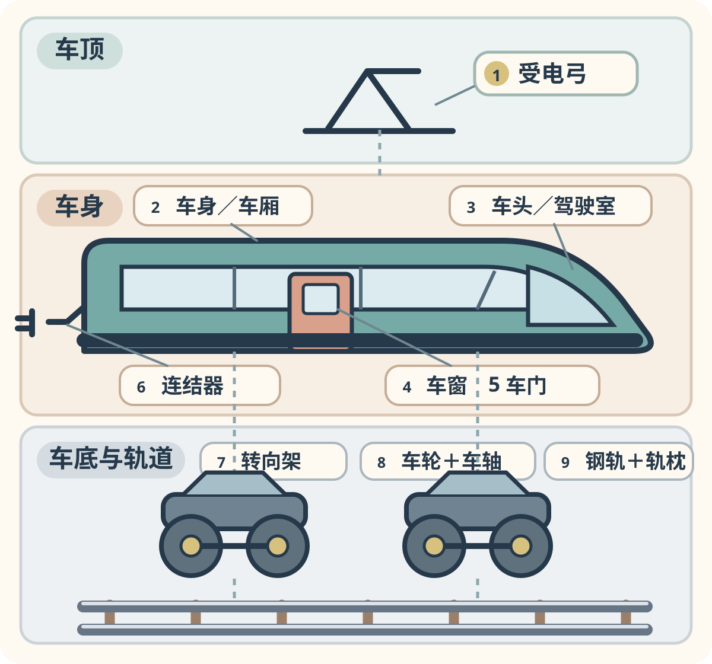

# 第一章：把火车拆开看看

[🏠 全书首页](README.md) · [蒸汽火车的诞生 →](02_steam_origins.md)

火车有长鼻子、方脸和圆脸，也有许多不同的颜色。不过，很多普通列车身上都能找到一些相似的部分。

下面画的是一辆常见电力动车组。为了看清楚，受电弓、连结器、转向架和轨道被轻轻移开了。真实列车不能这样拆，也不是每一种火车都长得一模一样。

**第一遍，只找车头、车门和车轮。** 找到了，就已经完成第一次观察。

## 车身上能找到什么？

- **车身／车厢：** 把乘客、座位、行李或设备装在里面。
- **车头和驾驶室：** 司机或驾驶设备工作的地方。列车另一端常常也有驾驶室。
- **车窗：** 让乘客看见外面，也让光线进入车厢。
- **车门：** 列车停稳后，乘客从这里上下车。

## 屋顶上面有什么？

- **受电弓：** 有些电力列车用它接触上方电线，把电送进车里。

不是所有电车都有受电弓。有些地铁从第三轨取电，有些列车把电装在电池里。蒸汽机车、柴油车、单轨和磁悬浮列车的屋顶也可能完全不同。

## 车身下面有什么？

- **转向架：** 装着轮子、弹簧和刹车等部件的“小推车”，可以顺着弯道转一点。
- **车轮和车轴：** 左右车轮常由车轴连在一起，在钢轨上滚动。
- **连结器：** 车辆之间的“握手器”，把一辆车和下一辆车连起来。

## 火车脚下有什么？

- **钢轨：** 普通火车的钢轮在它上面滚动。
- **轨枕：** 横在钢轨下面，帮助两根钢轨保持距离，并把重量继续传到下面。

有些轨道下面铺碎石，有些固定在混凝土板上。单轨、胶轮列车、齿轨铁路和磁悬浮又有自己的道路。后面的章节会跟着具体列车逐一打开这些秘密。

> **看图提醒：** 这是一张帮助认名字的拆分示意图，不按真实尺寸绘制，也省略了车内机器、电线、管路和许多小部件。车顶、车底、连结器和轨道都只能从书中图片、开放展区或安全位置观察。

---

[🏠 全书首页](README.md) · [蒸汽火车的诞生 →](02_steam_origins.md)
