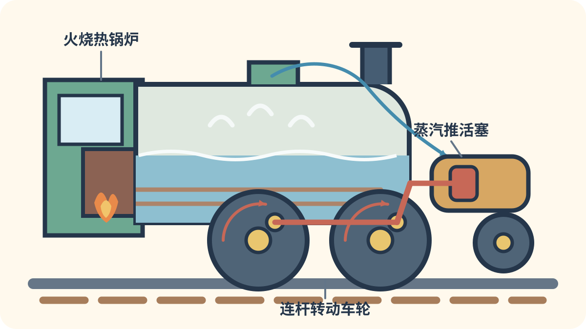
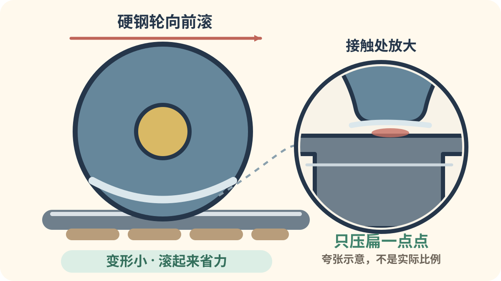
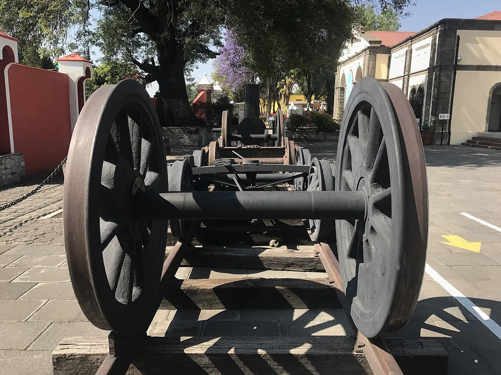
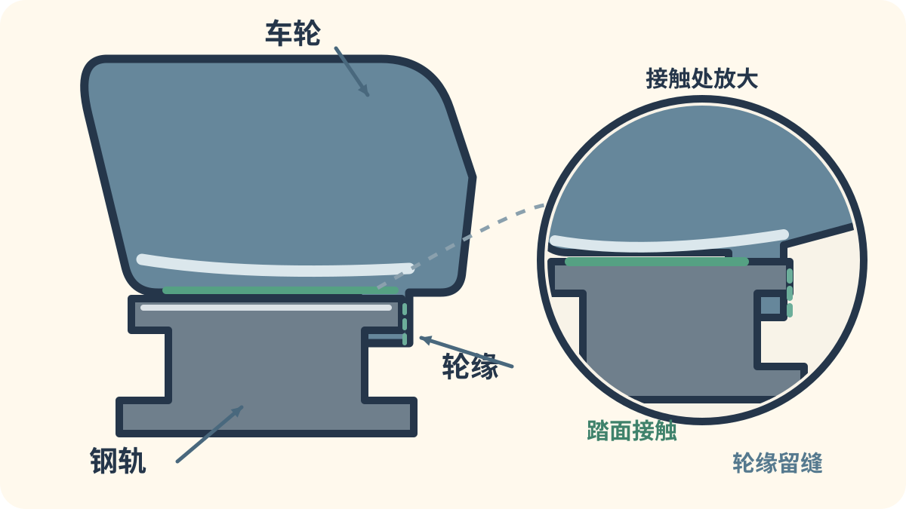

# 第二章：呼哧呼哧，火车从蒸汽开始

[← 把火车拆开看看](01_how_trains_move.md) · [🏠 全书首页](README.md) · [电力、柴油和新能量 →](03_power_revolution.md)

最早的机车像装上轮子的锅炉。后来，它们学会拉煤、拉客车，也长成了真正的钢铁巨人。我们从 1804 年出发，看看蒸汽火车怎样一步步长大。

看到 **🔍 打开看看**，可以停下来拆开一个小秘密，也可以先跳过继续看车。

🚉 选一个小站

今天挑一个小站就好，不用一次看完。

- [🚉 第1站：锅炉第一次装上轮子](#train-001)（4 辆车）
- [🚉 第2站：蒸汽火车去看世界](#train-005)（3 辆车）
- [🚉 第3站：为山路和重载想办法](#train-008)（2 辆车）
- [🚉 第4站：速度明星与钢铁巨人](#train-010)（5 辆车）

> 🚉 **第1站｜锅炉第一次装上轮子**

## 001｜潘尼达伦号 Pen-y-Darren

**出生卡：** 1804｜英国威尔士｜早期蒸汽机车

它像一只装上轮子的长锅炉。蒸汽推动活塞，再转动大飞轮。1804 年，它拉着铁块和乘客走上铁轨。人们第一次看见蒸汽机车完成这样的旅程。

**找找看：** 锅炉旁边的大飞轮藏在哪里？

🔎 给大人看细节

特里维西克的机车在潘尼达伦铁工厂铁路上完成了有记录的首次蒸汽机车铁路运输；沉重机车也暴露了铸铁轨易断的问题。

*图 001 · [作者与许可](IMAGE_CREDITS.md#img-t001-pen-y-darren)*

---

## 002｜喷气比利 Puffing Billy

**出生卡：** 1813｜英国｜蒸汽

圆圆的锅炉横放在一排车轮上。两根竖直汽缸把力量送给车轮。它在煤矿铁路上慢慢拉煤。两百多年后，真车仍被好好保存。

**找找看：** 你能找到锅炉上方两根直立的杆吗？

🔎 给大人看细节

它由威廉·赫德利等人为威拉姆煤矿铁路制造，通常被认为是现存最古老的蒸汽机车；服役中曾改变车轮数量。

*图 002 · [作者与许可](IMAGE_CREDITS.md#img-t002-puffing-billy)*

---

## 003｜动力一号 Locomotion No. 1

**出生卡：** 1825｜英国｜公共铁路蒸汽

它没有封闭的司机室，机器全露在外面。高烟囱把烟送到头顶。铁路开通那天，它拉着一长串车辆前进。队伍里既有货车，也有载人的车辆。

**找找看：** 司机站的位置有没有屋顶？

🔎 给大人看细节

1825 年 9 月 27 日，它牵引斯托克顿—达灵顿铁路的开通列车，成为公共铁路史的重要标志。

*图 003 · [作者与许可](IMAGE_CREDITS.md#img-t003-locomotion-no-1)*

---

## 004｜火箭号 Rocket

**出生卡：** 1829｜英国｜蒸汽

火箭号有一对醒目的大轮子。锅炉里藏着许多细火管，可以更快烧热水。它在机车比赛中又快又可靠。后来的蒸汽机车借用了许多相似办法。

**找找看：** 哪一对轮子最大，连杆又接在哪里？

🔎 给大人看细节

火箭号赢得 1829 年雨山试车；多火管锅炉、独立火箱等设计共同奠定了早期蒸汽机车的基本布局。

*图 004 · [作者与许可](IMAGE_CREDITS.md#img-t004-rocket)*

---

<!-- integrated-learning:after-004:start -->
### 🔍 打开火箭号看看：火怎样推动车轮？

火把锅炉里的水烧热。水变成蒸汽，跑进汽缸。蒸汽推着活塞来回走，红色连杆就带着大轮转起来。

🔎 给大人再讲一点

锅炉把燃料的化学能变成蒸汽的内能。配汽机构让蒸汽轮流进入汽缸两侧，活塞往复运动，连杆再把它变成车轮转动。图中省略了很多阀门和管路。

**一起找：** 在火箭号或其他蒸汽机车的照片里，找一根连着大轮的杆。真实机车很烫，只能远看。
<!-- integrated-learning:after-004:end -->

---

> 🚉 **第2站｜蒸汽火车去看世界**

## 005｜约翰牛号 John Bull

**出生卡：** 1831｜美国/英国制｜蒸汽

它在英国造好，再坐船去美国。美国铁路弯道多，机车也慢慢换了模样。前面加上排障器，司机身边也有了遮挡。照片里的样子，是多年改装后的成果。

**找找看：** 车头前面像扇子一样张开的是什么？

🔎 给大人看细节

约翰牛号由英国罗伯特·斯蒂芬森公司制造，服务于新泽西的卡姆登—安博伊铁路；排障器和司机室是抵美后加装的。

*图 005 · [作者与许可](IMAGE_CREDITS.md#img-t005-john-bull)*

---

<!-- integrated-learning:after-005:start -->
### 🔍 再看脚下：钢轮为什么爱走钢轨？

钢轮很硬，钢轨也很硬。轮子滚过时，它们只会压扁一点点，所以火车能省力地向前走。轨道还把重重的车身托住。

🔎 给大人再讲一点

钢轮和钢轨接触时变形较小，滚动阻力通常很低。重量会沿“车轮—钢轨—扣件—轨枕或轨道板—道床和路基”逐层分散。

**一起找：** 只从照片、车厢或博物馆护栏外看车轮；不靠近运行中的轨道。
<!-- integrated-learning:after-005:end -->

---

## 006｜鹰号 Adler

**出生卡：** 1835｜德国｜早期客运蒸汽

“Adler”在德语里是“鹰”。它拉着小客车，往返纽伦堡和菲尔特。车厢看起来很像马车。今天看到的鹰号，是照着老资料做的复制品。

**找找看：** 黄色客车的一扇扇小门排在哪里？

🔎 给大人看细节

鹰号由英国罗伯特·斯蒂芬森公司制造，牵引德国第一条成功运营的蒸汽客运铁路；原车已于 19 世纪拆解。

*图 006 · [作者与许可](IMAGE_CREDITS.md#img-t006-adler)*

---

## 007｜仙后号 Fairy Queen

**出生卡：** 1855｜印度/英国制｜蒸汽

它在英国出生，远渡海洋来到印度。一个大驱动轮很容易认出来。早年，它在东印度铁路上工作。经过修复，它曾在特别活动中展示运行。

**找找看：** 找到最大的车轮，再数数它前后的小轮。

🔎 给大人看细节

仙后号原为东印度铁路 22 号机车，现由印度国家铁路博物馆收藏，是保存至今且曾恢复运行的早期蒸汽机车。

*图 007 · [作者与许可](IMAGE_CREDITS.md#img-t007-fairy-queen)*

---

> 🚉 **第3站｜为山路和重载想办法**

## 008｜谢伊式 Shay

**出生卡：** 1870s｜美国｜齿轮传动蒸汽

普通机车用连杆直接推大轮。谢伊式却用传动轴和齿轮转动车轮。它跑得不快，却能走急弯和陡坡。这种设计很适合运木头的山林铁路。

**找找看：** 车身一侧那根长长的传动轴在哪里？

🔎 给大人看细节

埃弗雷姆·谢伊在 1870 年代发展出这一构想，利马机车厂自 1880 年起生产；侧置汽缸和伞齿轮传动是典型特征。

*图 008 · [作者与许可](IMAGE_CREDITS.md#img-t008-shay)*

---

<!-- integrated-learning:after-008:start -->
### 🔍 看真正的车轮：里面那圈凸边是什么？

*实拍：钢轨上的轮对。车轮内侧那圈凸边就是轮缘。· [图片署名](PRINCIPLE_PHOTO_CREDITS.md#principle-photo-p001-wheel-on-rail)*

先看真车轮：两圈凸边都藏在两条钢轨的里侧。

轮缘藏在车轮内侧。火车走在中间时，它常常不用碰钢轨。车轮偏得太多，轮缘才来挡一下。

🔎 给大人再讲一点

轮对的踏面并非简单圆柱。轮对横向移动时，两侧会出现不同的滚动半径，帮助它居中和通过曲线；轮缘主要是最后的限位帮手。

**一起找：** 隔着博物馆护栏，指一指轮缘藏在钢轮的哪一侧。
<!-- integrated-learning:after-008:end -->

---

## 009｜加勒特式 Garratt

**出生卡：** 1909起｜英国设计/世界｜铰接蒸汽

大锅炉像一座桥，架在两组动力车架之间。前后车架都能顺着弯道转一点。水和煤放在两端，重量会压在驱动轮上。这样的巨型机车也能走过弯弯的山路。

**找找看：** 白色蒸汽从黑色机车的哪些地方冒出来？

🔎 给大人看细节

赫伯特·威廉·加勒特取得铰接机车专利，英国贝耶—皮科克公司于 1909 年制造首台 K1，交付塔斯马尼亚使用。

*图 009 · [作者与许可](IMAGE_CREDITS.md#img-t009-garratt)*

---

> 🚉 **第4站｜速度明星与钢铁巨人**

## 010｜飞翔的苏格兰人 Flying Scotsman

**出生卡：** 1923｜英国｜特快蒸汽

它有三只排成一列的大驱动轮。绿色车身侧面写着自己的名字。它曾牵引伦敦与爱丁堡之间的特快列车。1934 年，它留下了每小时 100 英里的可靠速度记录。

**找找看：** 三只大驱动轮和侧面的金色名牌都找到了吗？

🔎 给大人看细节

“飞翔的苏格兰人”既是列车班次名，也是这台 LNER A1、后改 A3 型机车的名字；1934 年纪录被广泛视为首个经认证的蒸汽机车 100 mph 纪录。

*图 010 · [作者与许可](IMAGE_CREDITS.md#img-t010-flying-scotsman)*

---

## 011｜D51 D51

**出生卡：** 1936｜日本｜蒸汽

D51 是日本很有名的货运机车。长锅炉下面排着四对驱动轮。车头两侧的大板叫除烟板。许多车站和公园至今还保存着它。

**找找看：** 烟囱两旁的两块“大耳朵”是什么形状？

🔎 给大人看细节

D51 型于 1936—1945 年间制造 1,115 台，是日本数量最多的单一蒸汽机车型式，昵称“デゴイチ”。

*图 011 · [作者与许可](IMAGE_CREDITS.md#img-t011-d51)*

---

## 012｜野鸭号 Mallard

**出生卡：** 1938｜英国｜流线型蒸汽

它穿着光滑的蓝色外壳。楔形车头把空气轻轻分开。1938 年，野鸭号冲到每小时 126 英里。这个蒸汽机车世界纪录一直没有被打破。

**找找看：** 哪些管子和机器被蓝色外壳藏起来了？

🔎 给大人看细节

LNER A4 型野鸭号于 1938 年 7 月 3 日在斯托克坡跑出 126 mph（约 203 km/h），至今仍是获认证的蒸汽机车速度纪录。

*图 012 · [作者与许可](IMAGE_CREDITS.md#img-t012-mallard)*

---

## 013｜大男孩 Big Boy

**出生卡：** 1941｜美国｜铰接蒸汽

大男孩真的非常长。锅炉下面有前后两组驱动轮。前面一组能稍微摆动，帮助它通过弯道。它曾拉着重货列车翻越美国西部山地。

**找找看：** 你能把两组驱动轮之间的分界找出来吗？

🔎 给大人看细节

联合太平洋铁路在 1941—1944 年间接收 25 台 4-8-8-4 型 Big Boy；它采用铰接前部动力车架，但两个汽缸组均使用单胀蒸汽。

*图 013 · [作者与许可](IMAGE_CREDITS.md#img-t013-big-boy)*

---

## 014｜C62 C62

**出生卡：** 1948｜日本｜客运蒸汽

C62 是为快速客车准备的大机车。三对大驱动轮适合跑得又快又稳。车头两侧也有宽宽的除烟板。它牵引过“燕”号等著名列车。

**找找看：** 车头圆门上有没有一块长方形号码牌？

🔎 给大人看细节

49 台 C62 于 1948—1949 年间利用 D52 型货运机车的锅炉等部件制造，轴式改为适合干线客运的 4-6-4。

*图 014 · [作者与许可](IMAGE_CREDITS.md#img-t014-c62)*

---

[← 把火车拆开看看](01_how_trains_move.md) · [🏠 全书首页](README.md) · [电力、柴油和新能量 →](03_power_revolution.md)
