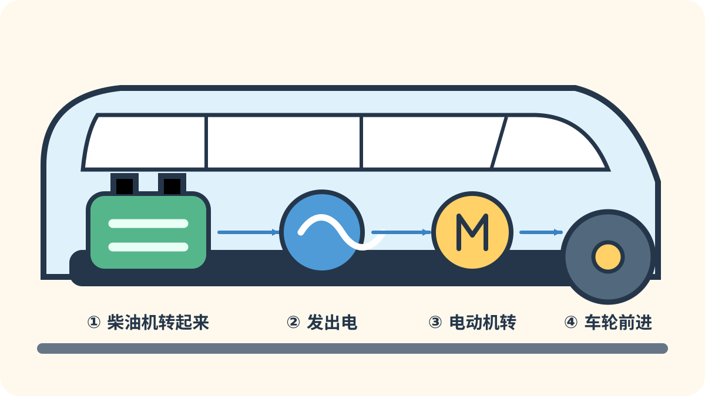
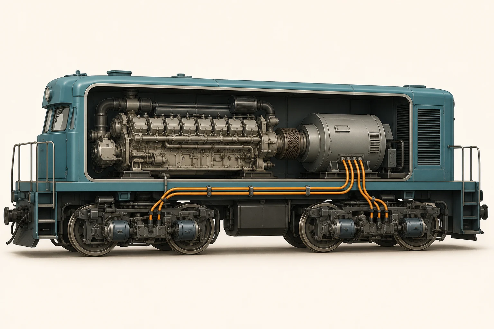
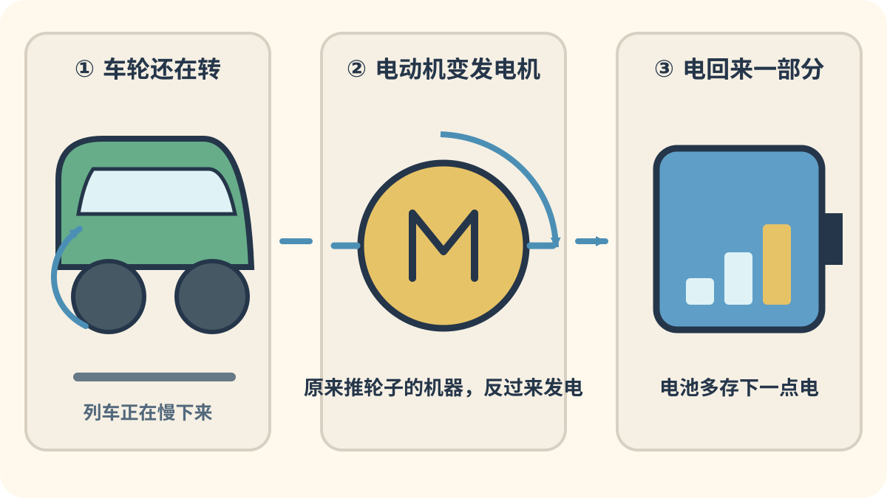

# 第三章：电力、柴油和新能量

[← 蒸汽火车的诞生](02_steam_origins.md) · [🏠 全书首页](README.md) · [高速列车怎样长大 →](04_high_speed_pioneers.md)

火车不只会烧煤。它们学会从电线取电，让柴油机带着发电机工作，还把电装进电池，试着使用氢能。把这些车放在一起，就能看见动力怎样一次次换新办法。

看到 **🔍 打开看看**，可以停下来拆开一个小秘密，也可以先跳过继续看车。

🚉 选一个小站

今天挑一个小站就好，不用一次看完。

- [🚉 第1站：电先出发](#train-015)（2 辆车）
- [🚉 第2站：柴油快车和老地铁](#train-019)（3 辆车）
- [🚉 第3站：把新能量装进车上](#train-121)（5 辆车）

> 🚉 **第1站｜电先出发**

## 015｜西门子-哈尔斯克电气铁路车 Siemens-Halske

**出生卡：** 1879｜德国｜早期电力

这台小车没有大锅炉和烟囱。电流从轨道送来，让电动机转动。它拉着开放式小座车绕圈。参观展览的人可以亲自坐一小段。

**找找看：** 小小的电气机车在长木凳的哪一边？

🔎 给大人看细节

维尔纳·冯·西门子在 1879 年柏林工业博览会上展示这条约 300 米长的电气铁路，它是早期载客电气铁路的重要示范。

*图 015 · [作者与许可](IMAGE_CREDITS.md#img-t015-siemens-electric-1879)*

---

## 017｜城市与南伦敦铁路电车 City & South London Railway

**出生卡：** 1890｜英国｜早期电力地铁

棕色小机车个头不大，却能拉着客车钻过伦敦的深隧道。它用电动机带动车轮。这样就不用在地下不断烧煤、喷烟。照片里的机车和木壳客车现在住在博物馆里。

**找找看：** 小机车后面，连着一节什么颜色的客车？

🔎 给大人看细节

城市与南伦敦铁路 1890 年开通，是世界上第一条电力牵引深层地下铁路；其早期小机车最初采用把电枢直接装在车轴上的无齿轮方案。

*图 017 · [作者与许可](IMAGE_CREDITS.md#img-t017-city-south-london)*

---

> 🚉 **第2站｜柴油快车和老地铁**

## 019｜飞行的汉堡人 Flying Hamburger

**出生卡：** 1933｜德国｜柴油流线动车组

两节车厢组成一列轻快的火车。圆圆的车头比老机车更光滑。柴油机先发电，再让电动机推动车轮。它曾快速往返柏林和汉堡。

**找找看：** 圆圆的车头上有几扇大窗、几盏圆灯？

🔎 给大人看细节

德国国营铁路 SVT 877 于 1933 年投入柏林—汉堡定期服务，是早期高速柴油电力流线动车组的代表。

*图 019 · [作者与许可](IMAGE_CREDITS.md#img-t019-flying-hamburger)*

---

## 020｜先锋西风号 Pioneer Zephyr

**出生卡：** 1934｜美国｜柴油流线动车组

银亮车身用不锈钢做成。车头很圆，外皮还有一条条波纹。三节车厢轻巧地连在一起。1934 年，它用一次长途快跑吸引了全美国的目光。

**找找看：** 阳光在波纹车身上变成了几种亮色？

🔎 给大人看细节

伯灵顿铁路的先锋西风号采用柴油电力、铰接车体和焊接不锈钢结构；1934 年“黎明到黄昏”展示运行从丹佛抵达芝加哥。

*图 020 · [作者与许可](IMAGE_CREDITS.md#img-t020-pioneer-zephyr)*

---

<!-- integrated-learning:after-020:start -->
### 🔍 打开一辆柴电机车：发动机为什么先发电？

柴油机先让发电机转，发电机再把电送给车轮旁的电动机。

现在去大图里，把这三样机器再找一遍。

*写实剖面插图（AI 生成，不是实拍）：只用来帮助找到大部件。· [生成说明](GENERATED_PRINCIPLE_IMAGES.md#diesel-electric-cutaway)*

🔎 给大人再讲一点

这是一辆通用柴电机车的教学剖面，不对应某个具体型号。柴油机械车和柴油液力车会用不同办法传力，不能只凭发动机声音判断传动形式。

**一起找：** 顺着图从柴油机指到发电机，再沿电缆指到车轮。
<!-- integrated-learning:after-020:end -->

---

## 022｜伦敦地铁 1938 Stock London Underground 1938 Stock

**出生卡：** 1938｜英国｜地铁

红色车身有一个圆圆的前脸。许多电气设备搬到了车厢地板下面。乘客空间因此更整齐。它在伦敦地下工作了大约半个世纪。

**找找看：** 圆头上的车窗和车灯怎样左右排队？

🔎 给大人看细节

1938 Stock 把大部分牵引设备布置在地板下，是伦敦地铁经典一体化动车组；该型在伦敦的常规服务持续至 1988 年。

*图 022 · [作者与许可](IMAGE_CREDITS.md#img-t022-london-underground-1938)*

---

> 🚉 **第3站｜把新能量装进车上**

## 121｜BEC819系 DENCHA：会把电装进电池

**出生卡：** 2016年｜日本九州｜蓄电池电车

有电线时，它一边跑一边给电池充电。离开电线后，电池把电送给电动机。DENCHA 这个名字像一句响亮的口令。

**找找看：** 车身上能找到 “DENCHA” 字样吗？

🔎 给大人看细节

BEC819系于2016年在若松线投入载客服务，是能在交流电气化区间充电、再驶入非电气化区间的蓄电池电动车组。

*图 121 · [作者与许可](IMAGE_CREDITS.md#img-t121-bec819-dencha)*

---

## 123｜H100形 DECMO：发动机先发电

**出生卡：** 2020年｜日本北海道｜柴油电力普通列车

DECMO 在没有电线的铁路上工作。柴油机先让发电机转，再由电动机推动车轮。紫色和绿色的小方块让它很好认。

**找找看：** 车门旁能找到多少种颜色？

🔎 给大人看细节

H100形于2020年开始载客，采用柴油机发电、电动机驱动车轮的电气式传动，方便JR北海道统一部分设备。

*图 123 · [作者与许可](IMAGE_CREDITS.md#img-t123-h100-decmo)*

---

## 127｜YC1系：刹车也能收集能量

**出生卡：** 2020年｜日本长崎地区｜混合动力柴油电力车

YC1 穿着亮黄和白色外衣。柴油机先发电，电动机再推车轮。刹车时，有些能量还能住进电池里。

**找找看：** 车头哪一块黄色最亮？

🔎 给大人看细节

YC1系于2020年开始载客，以柴油机发电并由电动机驱动，同时用蓄电池回收制动能量并辅助运行。

*图 127 · [作者与许可](IMAGE_CREDITS.md#img-t127-jr-kyushu-yc1)*

---

<!-- integrated-learning:after-127:start -->
### 🔍 YC1 刹车时，电会跑回电池吗？

刹车时，车轮还在转。车轮带着电动机转，电动机变成发电机。做出的一部分电，就跑回电池里了。

🔎 给大人再讲一点

再生制动能否工作，还取决于电网或储能装置能否接收能量。低速、黏着不足或系统不能接收时，列车会混合使用空气制动和摩擦制动等办法。

**一起找：** 坐稳扶好，听一听进站减速和出站加速的声音有什么不同。
<!-- integrated-learning:after-127:end -->

---

## 096｜HC85系 HC85 series

**出生卡：** 2022｜日本｜混合动力特急

HC85 去的地方，不一定有架空电线。柴油机带动发电机，电动机再转动车轮。电池会在需要时帮忙，也能收下一部分刹车能量。它带着“飞驒”和“南纪”号穿行山海之间。

**找找看：** 没有受电弓的车顶上，还能发现哪些机器？

🔎 给大人看细节

HC85 是 JR 东海的量产混合动力特急车辆，采用柴油发电机、蓄电池和牵引电动机组成的系统，2022 年先投入“飞驒”号。

*图 096 · [作者与许可](IMAGE_CREDITS.md#img-t096-hc85)*

---

## 122｜FV-E991系 HYBARI：氢能试验小勇士

**出生卡：** 2022年｜日本神奈川｜氢能混合动力试验车

HYBARI 是一列试验车。氢和空气里的氧帮它做出电，电池也来帮忙。工程师让它一次次试跑和学习。

**找找看：** 车身上有几只蓝绿色的小鸟图案？

🔎 给大人看细节

JR东日本自2022年起在南武线、鹤见线一带测试FV-E991系，研究燃料电池与蓄电池混合驱动的铁路车辆。

*图 122 · [作者与许可](IMAGE_CREDITS.md#img-t122-fv-e991-hybari)*

---

[← 蒸汽火车的诞生](02_steam_origins.md) · [🏠 全书首页](README.md) · [高速列车怎样长大 →](04_high_speed_pioneers.md)
