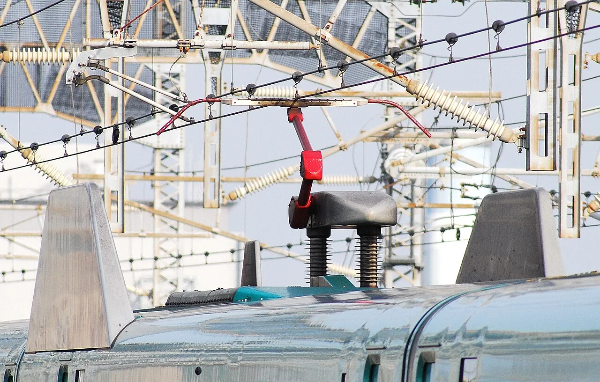

# 第五章：高速列车各有绝招

[← 高速列车怎样长大](04_high_speed_pioneers.md) · [🏠 全书首页](README.md) · [城市里的站站停 →](06_city_trains.md)

高速列车不只是鼻子长。有的能在普通山路线上前进，有的叠成两层，有的会检查轨道，还有的专门挑战未来速度。一起找找每辆快车最特别的本领。

看到 **🔍 打开看看**，可以停下来拆开一个小秘密，也可以先跳过继续看车。

🚉 选一个小站

今天挑一个小站就好，不用一次看完。

- [🚉 第1站：迷你新干线](#train-046)（4 辆车）
- [🚉 第2站：双层大个子](#train-047)（2 辆车）
- [🚉 第3站：雪国与长隧道](#train-049)（4 辆车）
- [🚉 第4站：高速也有不同长相](#train-035)（4 辆车）
- [🚉 第5站：新一代高速伙伴](#train-041)（3 辆车）
- [🚉 第6站：医生、样车和试验车](#train-053)（3 辆车）

> 🚉 **第1站｜迷你新干线**

## 046｜400系 Shinkansen 400 Series

**出生卡：** 1992｜日本｜迷你新干线

它能从新干线直通普通铁路。老铁路旁的空间较窄，车身也得变窄。在新干线站，小踏板会补上门边空隙。它还会和大列车牵手同行。

**找找看：** 绿色细线从尖鼻子旁边，一直绕到了哪里？

🔎 给大人看细节

400系是首款投入营业的“迷你新干线”车辆；山形方向的既有线改为标准轨距，窄车体则适应原有线路的车辆限界。

*图 046 · [作者与许可](IMAGE_CREDITS.md#img-t046-shinkansen-400)*

---

## 050｜E3系 Shinkansen E3 Series

**出生卡：** 1997｜日本｜迷你新干线

它比旁边的大新干线瘦一点。这样才能钻进秋田方向的老铁路。以前到了宽阔的新干线，它会和大车牵手。后来E6和E8接过了它的工作。

**找找看：** 它和E2并排时，谁的车身更窄？

🔎 给大人看细节

E3系先在1997年用于秋田新干线，后来也发展出山形新干线用车；窄车体和伸缩踏板都是直通既有线所需的设计。山形新干线E3系“翼号”已于2025年12月结束定期运行，由E8系接棒。

*图 050 · [作者与许可](IMAGE_CREDITS.md#img-t050-shinkansen-e3)*

---

## 057｜E6系 Shinkansen E6 Series

**出生卡：** 2013｜日本｜秋田迷你新干线

红色长鼻子像一支飞奔的箭。它在大新干线上和E5牵手。到了秋田方向，它自己走进较窄的铁路。身子虽瘦，同行时也能跑到320。

**找找看：** 和E5牵手时，两只长鼻子朝向哪里？

🔎 给大人看细节

E6系于2013年投入营业；在东北新干线区段可与E5系连挂并以320千米/时运行，进入既有线区段后则按该线路较低的限速行驶。

*图 057 · [作者与许可](IMAGE_CREDITS.md#img-t057-shinkansen-e6)*

---

## 062｜E8系 Shinkansen E8 Series

**出生卡：** 2024｜日本｜山形迷你新干线

紫色车头带着像红花一样鲜艳的黄色线条。它比E5瘦，能走进山形方向的老铁路。来到东北新干线，它会和E5牵手。长鼻子让它能以300千米时速同行。

**找找看：** 紫、白、黄三种颜色在哪里碰到一起？

🔎 给大人看细节

E8系于2024年3月16日投入营业；9米长“箭线”形车头兼顾窄车体空间与空气动力性能，在宇都宫至福岛间营业最高速度为300千米/时。

*图 062 · [作者与许可](IMAGE_CREDITS.md#img-t062-shinkansen-e8)*

---

> 🚉 **第2站｜双层大个子**

## 047｜E1系 Max Shinkansen E1 Series Max

**出生卡：** 1994｜日本｜全列双层新干线

从第一节到最后一节，它全有两层。楼上楼下都能坐人，像会跑的楼房。它叫Max，名字里也藏着“大容量”。宽宽的鼻子看起来很有力气。

**找找看：** 数一数，车身有几排窗户？

🔎 给大人看细节

E1系于1994年投入营业，是第一款全列双层的新干线电动车组；采用12辆编组，2012年退出营业。

*图 047 · [作者与许可](IMAGE_CREDITS.md#img-t047-shinkansen-e1)*

---

## 051｜E4系 Max Shinkansen E4 Series Max

**出生卡：** 1997｜日本｜双层新干线

它也是一列双层大楼。两列E4还能手拉手，合成16节长队。这样，一趟就能带走更多乘客。2021年，它结束了载客工作。

**找找看：** 车头哪一块会打开，让两列车牵手？

🔎 给大人看细节

E4系采用8辆全双层编组，两组连挂时共有16辆、定员最高达1634人；它于1997年投入营业，2021年退出定期运营。

*图 051 · [作者与许可](IMAGE_CREDITS.md#img-t051-shinkansen-e4)*

---

> 🚉 **第3站｜雪国与长隧道**

## 049｜E2系 Shinkansen E2 Series

**出生卡：** 1997｜日本｜新干线

红色腰带围着白色车身。它能在寒冷的北方铁路上奔跑。早些年，它也带乘客去长野。它还会和迷你新干线牵手。

**找找看：** 车头连接器平时藏在哪一扇盖子后面？

🔎 给大人看细节

E2系于1997年投入营业，曾用于长野、东北和上越新干线；部分编组设可开闭的头罩，可与E3系等车辆连挂。

*图 049 · [作者与许可](IMAGE_CREDITS.md#img-t049-shinkansen-e2)*

---

## 056｜E5系 Shinkansen E5 Series

**出生卡：** 2011｜日本｜东北新干线

长鼻子披着亮亮的青绿色。它把隧道前的空气慢慢推开。在东北新干线上，它最快能跑到320。它常和红色E6牵手同行。

**找找看：** 粉色腰带从鼻尖的哪一边开始弯？

🔎 给大人看细节

E5系于2011年投入营业，2013年起以320千米/时商业运行；长鼻形用于控制高速进出隧道产生的微气压波。

*图 056 · [作者与许可](IMAGE_CREDITS.md#img-t056-shinkansen-e5)*

---

<!-- integrated-learning:after-056:start -->
### 🔍 抬头看 E5：车顶的“胳膊”碰着什么？

*实拍：E5 系车顶的受电弓。· [图片署名](PRINCIPLE_PHOTO_CREDITS.md#principle-photo-p002-e5-pantograph)*

先看真车：黑色滑板在最上面，正好顶住头顶的电线。

受电弓像一只会伸缩的胳膊。它的顶端轻轻顶住电线。列车向前跑，滑板就沿着电线滑，把电接进车里。

🔎 给大人再讲一点

弹簧或气动装置给受电弓受控的向上力。高速时受电弓和接触线都会振动，所以接触线张力、受电弓外形和主动控制要一起设计。

**一起找：** 只在封闭车厢、站台安全区或照片里找受电弓。车顶和电线永远不能碰。
<!-- integrated-learning:after-056:end -->

---

## 058｜E7/W7系 Shinkansen E7/W7 Series

**出生卡：** 2014｜日本｜北陆新干线

一个叫E7，一个叫W7。两家公司照顾它们，外形像双胞胎。蓝色车顶和铜色腰带很特别。它带大家去长野、金泽和敦贺。

**找找看：** 蓝、白、铜三种颜色从上到下怎样排？

🔎 给大人看细节

E7由JR东日本、W7由JR西日本拥有，两型车共同开发；E7于2014年先投入营业，W7随北陆新干线延至金泽于2015年载客。

*图 058 · [作者与许可](IMAGE_CREDITS.md#img-t058-shinkansen-e7-w7)*

---

## 059｜H5系 Shinkansen H5 Series

**出生卡：** 2016｜日本｜北海道新干线

它和E5很像，却系着紫色腰带。车内图案还藏着北海道的雪花。它从本州钻过青函海底隧道。再抬头，已经来到北海道。

**找找看：** 它和E5最容易用哪条腰带来区分？

🔎 给大人看细节

H5系由E5系发展而来，于2016年随北海道新干线新青森至新函馆北斗段开业投入营业，外观识别点是薰衣草紫色腰带。

*图 059 · [作者与许可](IMAGE_CREDITS.md#img-t059-shinkansen-h5)*

---

> 🚉 **第4站｜高速也有不同长相**

## 035｜Talgo 350 Talgo 350

**出生卡：** 2005｜西班牙｜高速

宽宽的扁鼻子让人想到鸭嘴。西班牙人也叫它“Pato”，就是鸭子。中间的 Talgo 客车低矮又轻巧。两头动力车夹着它们高速前进。

**找找看：** 鸭嘴形车头的灯像不像两只小眼睛？

🔎 给大人看细节

Talgo 350 的运营型号为 Renfe 102 型，由 Talgo 与庞巴迪合作；“350”是设计速度等级，商业运营速度通常不等于这个数字。

*图 035 · [作者与许可](IMAGE_CREDITS.md#img-t035-talgo-350)*

---

## 039｜Italo AGV 575 Italo AGV 575

**出生卡：** 2012｜意大利｜高速

深红和金色是 Italo 的醒目外衣。它没有专门占一整辆的动力车。电动机分散在列车下面。这样，乘客从车头后面就能开始坐。

**找找看：** 深红色车鼻上，金色线条绕出了什么形状？

🔎 给大人看细节

AGV 575 由阿尔斯通制造，采用分布式牵引和铰接转向架；NTV 于 2012 年把它投入 Italo 商业服务。

*图 039 · [作者与许可](IMAGE_CREDITS.md#img-t039-agv-italo)*

---

## 040｜Frecciarossa 1000 Frecciarossa 1000

**出生卡：** 2015｜意大利｜高速

“Frecciarossa”意思是“红箭”。细长车鼻上有红、黑、白三种颜色。动力分散在八节车厢中。它还能使用多种铁路供电方式。

**找找看：** 红色从车鼻尖一直延伸到哪一节车厢？

🔎 给大人看细节

Frecciarossa 1000 即 ETR 1000，由安萨尔多百瑞达与庞巴迪联合开发；它是八辆编组、多电压制式的分布式动力动车组。

*图 040 · [作者与许可](IMAGE_CREDITS.md#img-t040-frecciarossa-1000)*

---

## 055｜N700系 Shinkansen N700 Series

**出生卡：** 2007｜日本｜新干线/车体倾斜

它的鼻子像一团弯弯的气流。过一些弯道时，车身会轻轻向内倾。这样能更稳、更快地通过弯道。这个家族的不同成员，奔跑在东海道、山阳和九州新干线上。

**找找看：** 鼻子两侧有几条像波浪一样的棱线？

🔎 给大人看细节

N700系于2007年投入营业；空气弹簧式车体倾斜系统可让车体小幅内倾，从而提高东海道新干线曲线区段的通过速度。

*图 055 · [作者与许可](IMAGE_CREDITS.md#img-t055-shinkansen-n700)*

---

> 🚉 **第5站｜新一代高速伙伴**

## 041｜复兴号 CR400AF/BF Fuxing CR400AF/BF

**出生卡：** 2017｜中国｜高速

复兴号有 AF 和 BF 等不同平台。它们的车鼻、车灯和颜色不完全一样。车内的许多电动机分散出力。两种列车都按同一套中国标准动车组要求配合线路运行。

**找找看：** 比一比 AF 和 BF，谁的车灯更靠近鼻尖？

🔎 给大人看细节

CR400AF 与 CR400BF 由不同企业平台研制并采用统一技术标准；2017 年起投入商业运营，同年在京沪高铁按 350 km/h 运行。

*图 041 · [作者与许可](IMAGE_CREDITS.md#img-t041-cr400-fuxing)*

---

## 061｜N700S Shinkansen N700S

**出生卡：** 2020｜日本｜东海道/山阳新干线

S代表Supreme，意思是更棒的一代。鼻子两侧像多了一点鼓鼓的脸颊。小一些的设备模块让编组更好安排。断电时，电池还能帮它慢慢移动。

**找找看：** 车头灯旁的棱线像不像一对小翅膀？

🔎 给大人看细节

N700S于2020年投入营业；其标准化设备布局便于组成不同长度的编组，并设锂离子电池自走系统供停电等异常情况下低速移动。

*图 061 · [作者与许可](IMAGE_CREDITS.md#img-t061-shinkansen-n700s)*

---

## 152｜复兴号 CR300AF：浅蓝色新伙伴

**出生卡：** 2021年｜中国｜高速动车组

浅蓝色车身像晴天的天空。八节车厢里，有四节会一起出力。它和CR400一样属于复兴号家族，但速度等级不同。

**找找看：** 浅蓝色车鼻上能找到几盏灯？

🔎 给大人看细节

CR300AF于2021年开始正式载客，八辆编组采用四动四拖，是250公里速度等级的中国标准动车组。“复兴蓝”等是铁路迷常用称呼，不是正式型号。

*图 152 · [作者与许可](IMAGE_CREDITS.md#img-t152-cr300af)*

---

> 🚉 **第6站｜医生、样车和试验车**

## 053｜923型 Doctor Yellow / Class 923

**出生卡：** 2000｜日本｜高速综合检测车

这种黄车不载普通乘客。它边跑边给轨道和电线做检查。车顶和车底藏着许多测量工具。照片里的T4已经退休，T5计划工作到2027年1月。“黄色医生”这个名字真贴切。

**找找看：** 黄色车顶上，哪里藏着检查电线的设备？

🔎 给大人看细节

923型以700系为基础，可在高速运行中测量轨道、接触网、信号和通信等设施。主图是JR东海T4编组，已于2025年1月结束检测；JR西日本T5编组计划于2027年1月结束检测，此后由N700S营业列车搭载的检测功能接棒。

*图 053 · [作者与许可](IMAGE_CREDITS.md#img-t053-doctor-yellow)*

---

## 060｜ALFA-X E956试验车 ALFA-X Series E956

**出生卡：** 2019｜日本｜高速试验车

它不载普通乘客，是一间会跑的实验室。两端鼻子的长度和形状不一样。工程师让它试刹车、过隧道和抗风雪。未来列车会从这些试验里学本领。

**找找看：** 从黑色挡风玻璃到鼻尖，要用手比出多长的一段？

🔎 给大人看细节

E956型ALFA-X为10辆编组，自2019年起试跑；它为未来360千米/时营业运行研究技术，试验速度最高可设至400千米/时。

*图 060 · [作者与许可](IMAGE_CREDITS.md#img-t060-alfa-x)*

---

## 160｜CR450 样车：跑向时速 400 公里

**出生卡：** 2024年样车发布｜中国｜高速动车组样车

这是 CR450 家族的一列样车，照片里是 CR450BF。它的车头又长又尖，车身也比上一代矮一点。试验时，单独一列车最高跑到每小时 453 公里。它还在参加考试，未来载客运营目标是每小时 400 公里。

**找找看：** 从黑色挡风玻璃到鼻尖，长长的车头占了多大一段？

🔎 给大人看细节

CR450 样车包括 CR450AF 和 CR450BF，2024 年 12 月 29 日正式发布，均为八辆、四动四拖。2025 年试验中，单列最高达到 453 km/h；两列相向交会的相对速度达到 896 km/h，不能把它误写成单列车速。截至 2026 年 3 月的公开进展，样车已通过全部型式试验并完成约 30 万公里运用考核，仍在为设计定型和载客运营做准备；400 km/h 是目标商业运营速度，不是已经开始的日常服务。

*图 160 · [作者与许可](IMAGE_CREDITS.md#img-t160-cr450)*

---

[← 高速列车怎样长大](04_high_speed_pioneers.md) · [🏠 全书首页](README.md) · [城市里的站站停 →](06_city_trains.md)
