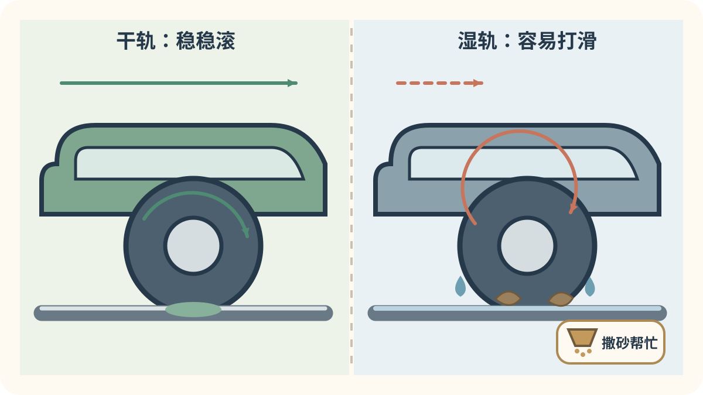
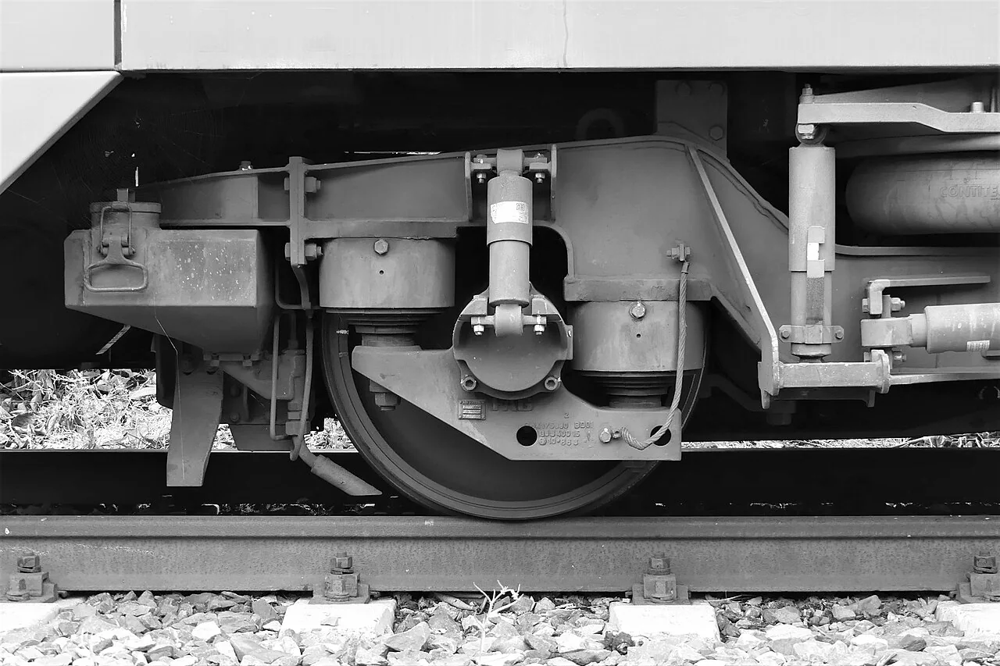

# 第七章：穿过田野、海边和小城

[← 城市里的站站停](06_city_trains.md) · [🏠 全书首页](README.md) · [机场与远方特急 →](08_express_airport.md)

离开大城市，列车会穿过雪地、稻田、海岸和许多小站。它们不一定最快，却把每天上学、上班和回家的人送到很远。窗外的风景，也是这章的一部分。

看到 **🔍 打开看看**，可以停下来拆开一个小秘密，也可以先跳过继续看车。

🚉 选一个小站

今天挑一个小站就好，不用一次看完。

- [🚉 第1站：穿过雪国和群山](#train-124)（2 辆车）
- [🚉 第2站：城市之间快进快出](#train-125)（5 辆车）
- [🚉 第3站：田野、海边和小巷](#train-128)（3 辆车）

> 🚉 **第1站｜穿过雪国和群山**

## 124｜733系：雪国里的绿色长队

**出生卡：** 2012年｜日本北海道｜交流通勤电车

银色列车系着绿色腰带。长椅沿墙排开，给上下车的人留出通道。下雪的札幌也常能遇见它。

**找找看：** 绿色线条绕过了哪些车门和窗户？

🔎 给大人看细节

733系自2012年起在札幌都市圈使用，低地板和通勤型长座椅是它面向日常客流的重要设计。

*图 124 · [作者与许可](IMAGE_CREDITS.md#img-t124-jr-hokkaido-733)*

---

<!-- integrated-learning:after-124:start -->
### 🔍 跟着 733 系过雪地：轮子为什么会滑？

干净的钢轨能让车轮稳稳滚。雨水、落叶和冰雪会让它变滑。列车会把力量放小一点，有些机车还会撒一点砂。

🔎 给大人再讲一点

牵引力和制动力都经很小的轮轨接触区传递。防空转、防滑控制会迅速调整每根车轴的力，撒砂则能改善局部接触条件。

**一起找：** 雨天只在车厢里听起步声，和晴天比较是否一样平顺。
<!-- integrated-learning:after-124:end -->

---

## 142｜SBB RABe 523 FLIRT：瑞士红色区域列车

**出生卡：** 2004年起｜瑞士｜区域电动车组

红色 FLIRT 在瑞士做区域列车。低低的地板让上下车更方便。车厢之间可以一路走过去。

**找找看：** 红色车身上有几扇低低的车门？

🔎 给大人看细节

FLIRT区域电动车组自2004年起在瑞士投入使用，RABe 523是SBB采用的低地板贯通式版本之一。

*图 142 · [作者与许可](IMAGE_CREDITS.md#img-t142-sbb-rabe-523-flirt)*

---

> 🚉 **第2站｜城市之间快进快出**

## 125｜227系 Red Wing：红色翅膀

**出生卡：** 2015年｜日本广岛地区｜近郊电车

红色车头像展开一对翅膀。它在广岛一带接送每天出门的人。“Red Wing”就是“红色翅膀”。

**找找看：** 红色从车头一直跑到了哪里？

🔎 给大人看细节

227系于2015年首先在广岛地区投入服务，最初使用的红色识别设计呼应了当地喜爱的红色意象。

*图 125 · [作者与许可](IMAGE_CREDITS.md#img-t125-jr-west-227-red-wing)*

---

## 156｜CRH6A：城际快进快出

**出生卡：** 2015年｜中国｜城际动车组

CRH6A常在城市和城市之间来回跑。大门多，停车后能让许多人快快上下。它起步快、停车勤，很适合城际通勤。

**找找看：** 一节车厢的一侧能找到几组大门？

🔎 给大人看细节

CRH6A于2015年获得国家铁路局颁发的型号合格证和制造许可证，属于200公里速度等级；八辆编组版本最大载客量为1488人。它是面向城际铁路设计的动车组，不能笼统地叫作地铁。

*图 156 · [作者与许可](IMAGE_CREDITS.md#img-t156-crh6a)*

---

## 126｜821系：黑脸亮眼睛

**出生卡：** 2019年｜日本九州｜交流近郊电车

黑色大前窗旁有一圈亮灯。它从头顶电线取得交流电。车门一开，就忙着接送九州乘客。

**找找看：** 车头的灯排成了什么形状？

🔎 给大人看细节

821系于2019年开始载客，是JR九州面向普通和近郊服务设计的交流电动车组。

*图 126 · [作者与许可](IMAGE_CREDITS.md#img-t126-jr-kyushu-821)*

---

## 068｜JR东海315系 JR Central 315 Series

**出生卡：** 2022｜日本｜通勤电车

脸上画着橙色和白色粗线。长长的座椅方便大家在车内移动。它带着摄像头和清楚的显示屏。紧急断电时，电池还能帮它走一小段。

**找找看：** 车头的橙色线条拐了几个直角？

🔎 给大人看细节

315系于2022年投入营业，配备车内防犯摄像头、应急走行用蓄电池，并在电力转换装置中采用高效率功率器件。

*图 068 · [作者与许可](IMAGE_CREDITS.md#img-t068-jr-central-315)*

---

## 074｜西武40000系 Seibu 40000 Series

**出生卡：** 2017｜日本｜座席转换通勤车

一排座椅会变魔术。忙时沿墙排开，留出更多站立空间。跑远路时，它们转成面朝前后。列车还能穿过几家公司的铁路。

**找找看：** 蓝色和绿色在车头上，是怎样慢慢变到一起的？

🔎 给大人看细节

40000系于2017年投入营业；0番台使用可在纵向、横向之间转换的L/C座席，并用于跨越西武、东京地铁、东急等线路的S-TRAIN。

*图 074 · [作者与许可](IMAGE_CREDITS.md#img-t074-seibu-40000)*

---

> 🚉 **第3站｜田野、海边和小巷**

## 128｜JR四国1500形：绿色田野号

**出生卡：** 2006年｜日本四国｜普通柴油车

绿色线条像四国的田野。没有架空电线时，柴油机带它前进。门口离站台较近，上下车更方便。

**找找看：** 绿色线条像不像一片片叶子？

🔎 给大人看细节

1500形自2006年起用于高德线、德岛线等线路，设计时兼顾较低的上下车台阶和更清洁的柴油机排放。

*图 128 · [作者与许可](IMAGE_CREDITS.md#img-t128-jr-shikoku-1500)*

---

## 136｜三陆铁道36-700形：把海岸装进大窗

**出生卡：** 2013年｜日本岩手｜普通柴油车

蓝、红、白三种颜色像海边的旗子。它沿着岩手海岸接送乘客。大窗把山和海装进旅程里。

**找找看：** 蓝、红、白三种颜色分别藏在哪里？

🔎 给大人看细节

三陆铁道36-700形自2013年起作为普通柴油客车使用，车内混合布置横向座椅和沿墙长座椅。

*图 136 · [作者与许可](IMAGE_CREDITS.md#img-t136-sanriku-36-700)*

---

## 129｜江之电300形：房子和海之间的小电车

**出生卡：** 1956年起｜日本神奈川｜两节编组电车

两节绿黄小电车手拉手跑。它会穿过房屋旁的窄路，也会望见湘南海边。圆灯让这张老面孔很好认。

**找找看：** 车头有几扇大窗、几盏圆灯？

🔎 给大人看细节

江之电300形家族自1956年起出现，如今仍可见的305—355编组由两辆车固定相连，在江之岛电铁线上运行。

*图 129 · [作者与许可](IMAGE_CREDITS.md#img-t129-enoden-300)*

---

<!-- integrated-learning:after-129:start -->
### 🔍 车厢下面的小架子，为什么会转？

*实拍：车厢下面的一副转向架。· [图片署名](PRINCIPLE_PHOTO_CREDITS.md#principle-photo-p003-bogie-suspension)*

先看真车：两组轮对和好几只弹簧，都装在同一个小架子上。

两组轮对和弹簧装在一个会转的小架子里，它叫转向架。长车厢过弯时，前后转向架会各自顺着钢轨转一点。

🔎 给大人再讲一点

转向架组织轮对、轴箱、悬挂、减振和制动装置。也有单轴、共享转向架和其他结构，不能只靠外观看见的轮子数量判断。

**一起找：** 在侧面照片或博物馆护栏外，数一节车厢下面有几副转向架。
<!-- integrated-learning:after-129:end -->

---

[← 城市里的站站停](06_city_trains.md) · [🏠 全书首页](README.md) · [机场与远方特急 →](08_express_airport.md)
