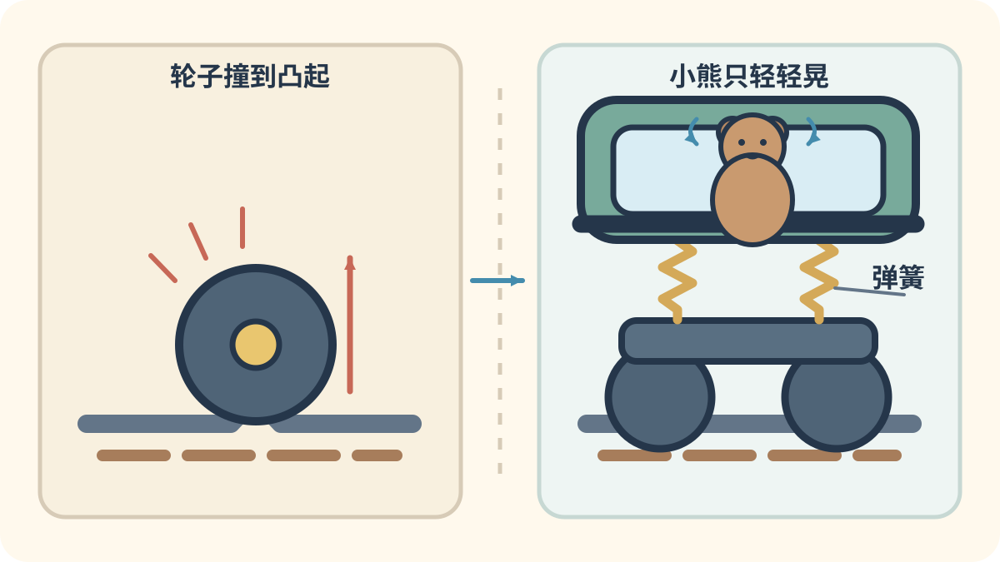

# 第九章：会睡觉、看风景和变装

[← 机场与远方特急](08_express_airport.md) · [🏠 全书首页](README.md) · [火车头和铁路工作队 →](10_work_trains.md)

坐火车有时不只是赶路。有人在车上睡觉，有人望着森林和大海，还有列车穿上卡通、木头或小鱼的新衣服。慢慢看，它们把旅程本身变成了目的地。

看到 **🔍 打开看看**，可以停下来拆开一个小秘密，也可以先跳过继续看车。

🚉 选一个小站

今天挑一个小站就好，不用一次看完。

- [🚉 第1站：车上睡一晚](#train-016)（3 辆车）
- [🚉 第2站：大窗把风景装进来](#train-081)（4 辆车）
- [🚉 第3站：展望席三代](#train-078)（3 辆车）
- [🚉 第4站：角色和彩绘列车](#train-085)（3 辆车）

> 🚉 **第1站｜车上睡一晚**

## 016｜东方快车 Orient Express

**出生卡：** 1883起｜欧洲｜国际豪华列车

“东方快车”是一个从 1883 年开始旅行欧洲的老名字。照片里的列车穿着深蓝和金色外衣。车上有卧铺、餐车和精美装饰。不同年代的路线和车辆并不完全一样。

**找找看：** 机车后面，能数到几节深蓝色车厢？

🔎 给大人看细节

国际卧铺车公司于 1883 年开行东方快车；这个名称指不断演变的国际列车服务，并非一组从未更换的固定车辆。主图为后来继承其旅行传统的威尼斯—辛普伦东方快车。

*图 016 · [作者与许可](IMAGE_CREDITS.md#img-t016-orient-express)*

---

## 083｜Sunrise Express 285系 285 series

**出生卡：** 1998｜日本｜夜行卧铺电车

天黑以后，它载着一间间小卧室出发。乘客躺下睡觉，窗外的城市悄悄后退。它不是由机车牵引，电动设备分散在列车里。清晨醒来，目的地也越来越近了。

**找找看：** 上下两层的小窗，哪一扇像你的卧室窗？

🔎 给大人看细节

285 系以 7 节为一个编组，服务于“Sunrise 濑户”和“Sunrise 出云”；两列可在东京至冈山间连挂运行，再分别前往四国和山阴。

*图 083 · [作者与许可](IMAGE_CREDITS.md#img-t083-sunrise-285)*

---

<!-- integrated-learning:after-083:start -->
### 🔍 车轮咚一下，床为什么只轻轻晃？

*实拍：轮子上方真的有弹簧和减振器。· [图片署名](PRINCIPLE_PHOTO_CREDITS.md#principle-photo-p003-bogie-suspension)*

先看真车：轮子上方的大弹簧可以压短，旁边的减振器会拉住摇晃。

车轮撞到不平的地方，弹簧就压短。减振器把大颠簸变成小摇晃，床上的小熊就不会被抛起来。

🔎 给大人再讲一点

常见转向架有一级和二级悬挂。弹簧储存并释放能量，减振器逐渐耗散振动；设计要同时照顾轮轨接触和车辆稳定，并非越软越好。

**一起找：** 坐稳扶好，比较车轮声和座椅晃动：每次“咚”都一样大吗？
<!-- integrated-learning:after-083:end -->

---

## 088｜九州七星号 77系 Seven Stars in Kyushu

**出生卡：** 2013｜日本｜豪华巡游

深红色列车像一座会移动的小旅馆。里面有卧室、客厅和餐车。它不会急着赶到终点，而是带乘客慢慢游九州。前面的专用柴油机车负责拉动车厢。

**找找看：** 深红色车身上，能找到金色的“七星”吗？

🔎 给大人看细节

“九州七星”由专用 DF200-7000 型柴油电力机车牵引 7 节 77 系客车，2013 年开始以多日行程巡游九州。

*图 088 · [作者与许可](IMAGE_CREDITS.md#img-t088-seven-stars)*

---

> 🚉 **第2站｜大窗把风景装进来**

## 081｜由布院之森 KiHa 71/72 Yufuin no Mori

**出生卡：** 1989｜日本｜观光特急

深绿色车身像从森林里开出来。高高的地板让乘客更容易越过树木看风景。车内有大窗，也有让旅途变慢的休息空间。柴油机带着它驶向温泉小镇由布院。

**找找看：** 哪一排窗户离铁轨最远？

🔎 给大人看细节

“由布院之森”最早的 KiHa 71 编组于 1989 年登场，KiHa 72 编组于 1999 年加入；两者都是 JR 九州为观光体验打造的柴油特急。

*图 081 · [作者与许可](IMAGE_CREDITS.md#img-t081-yufuin-no-mori)*

---

## 087｜Resort白神 HB-E300 Resort Shirakami

**出生卡：** 2010｜日本｜混合动力观光列车

它沿着日本海和白神山地慢慢看风景。柴油机先带动发电机，电再送给车轮旁的电动机。电池还能存下一部分能量。大窗把海、山和晚霞都装进车厢。

**找找看：** 哪一扇窗最适合看一整片大海？

🔎 给大人看细节

HB-E300 是串联式混合动力柴油动车组，由柴油发电机和蓄电池共同为牵引电动机供电；“Resort 白神”用车自 2010 年起投入五能线。

*图 087 · [作者与许可](IMAGE_CREDITS.md#img-t087-resort-shirakami)*

---

## 089｜近铁岛风50000系 Kintetsu 50000 series Shimakaze

**出生卡：** 2013｜日本｜观光特急

“岛风”要把乘车本身变成一场旅行。车头的大窗前，展望座席被放得高高的。车内还有面对风景的座位和双层咖啡车厢。它载着乘客驶向伊势志摩。

**找找看：** 大前窗被分成了多少块玻璃？

🔎 给大人看细节

近铁 50000 系以 6 节编组运行，2013 年首先连接大阪难波和贤岛，后来又开行京都、名古屋方向班次，共制造 3 个编组。

*图 089 · [作者与许可](IMAGE_CREDITS.md#img-t089-kintetsu-shimakaze)*

---

## 095｜E261系 Saphir Odoriko E261 series

**出生卡：** 2020｜日本｜观光特急

蓝绿色车身像伊豆的海水。“Saphir”是蓝宝石的法语名字。车里有面向风景的座位、包间和餐饮空间。它从东京方向出发，沿海岸去伊豆旅行。

**找找看：** 车身上有几种像海一样的蓝色？

🔎 给大人看细节

E261 系采用 8 节编组，2020 年起担当“蓝宝石舞女”号；全列均为绿色车厢等级，并设 Premium Green、包间和餐饮车厢。

*图 095 · [作者与许可](IMAGE_CREDITS.md#img-t095-saphir-odoriko)*

---

> 🚉 **第3站｜展望席三代**

## 078｜小田急 Romancecar NSE 3100型 Odakyu 3100 series NSE

**出生卡：** 1963｜日本｜展望特急

最前面的乘客可以看见铁轨向远方伸去。司机在哪里呢？驾驶室被举到了展望席上方。短短的车厢还共用一些转向架，像一条灵活的长虫。

**找找看：** 大前窗上方，能找到司机的小窗吗？

🔎 给大人看细节

NSE 采用 11 节铰接式编组，两端均设前方展望席，驾驶室位于其上；它获得了 1964 年日本铁道友之会蓝丝带奖。

*图 078 · [作者与许可](IMAGE_CREDITS.md#img-t078-odakyu-nse)*

---

## 086｜小田急VSE 50000型 Odakyu 50000 series VSE

**出生卡：** 2005｜日本｜展望特急

VSE 的白色车身像一条丝带。最前面的座位前方，是一整面大窗。司机坐在乘客头顶的小驾驶室里。十节相连的车厢，曾带大家去箱根旅行。

**找找看：** 红色细线从车头一直跑到了哪里？

🔎 给大人看细节

VSE 是 10 节铰接式 Romancecar，两端设前方展望席和高位驾驶室；它获得了 2006 年蓝丝带奖，并于 2023 年退役。

*图 086 · [作者与许可](IMAGE_CREDITS.md#img-t086-odakyu-vse)*

---

## 092｜小田急GSE 70000型 Odakyu 70000 series GSE

**出生卡：** 2018｜日本｜展望特急

红红的 GSE 有一张弯弯的大前窗。坐在最前排，铁轨就像从脚下铺出去。高处的小驾驶室让司机看清前方。七节车厢一起把旅客送往箱根方向。

**找找看：** 大前窗里面，最靠近铁轨的是哪一排座位？

🔎 给大人看细节

GSE 的全名含义是 Graceful Super Express，采用 7 节固定编组，两端设前方展望席；它获得了 2019 年蓝丝带奖。

*图 092 · [作者与许可](IMAGE_CREDITS.md#img-t092-odakyu-gse)*

---

> 🚉 **第4站｜角色和彩绘列车**

## 085｜四国面包超人列车 Anpanman Train

**出生卡：** 2000起｜日本｜主题列车

面包超人和伙伴们跑到了车身上。不同线路的列车，会穿上不同颜色的卡通外衣。有些车厢里也藏着角色图案。对小乘客来说，找朋友就是旅途的一部分。

**找找看：** 你能在车身上找到几个圆圆的角色脸？

🔎 给大人看细节

JR 四国从 2000 年的土赞线列车开始发展“面包超人列车”，此后扩展到多条线路和多种车型；它是一个主题列车家族，并非单一型号。

*图 085 · [作者与许可](IMAGE_CREDITS.md#img-t085-anpanman-train)*

---

## 090｜铁道Hobby Train KiHa 32 Tetsudo Hobby Train

**出生卡：** 2014｜日本｜主题柴油车

这原本是一节小小的柴油车。设计师给它的一端装上了仿 0 系新干线的圆鼻子。里面还有模型火车和铁路小展品。慢慢跑的乡间列车，也能做一个新干线的梦。

**找找看：** 哪一端戴着圆圆的“新干线鼻子”？

🔎 给大人看细节

“铁道 Hobby Train”由 JR 四国 KiHa 32-3 改造，2014 年起用于予土线；仿 0 系造型只设在车体一端。

*图 090 · [作者与许可](IMAGE_CREDITS.md#img-t090-hobby-train)*

---

## 149｜めでたいでんしゃ：在铁轨上游的小鱼家族

**出生卡：** 2016年起｜日本和歌山、加太线｜7100系改造主题电车

粉红、蓝、红、黑的小鱼电车各有名字。车头圆灯像鱼眼，车里还藏着鳞片和海底朋友。它们在和歌山市与加太之间游来游去。

**找找看：** 你能找到几只鱼、几片鳞和几颗心？

🔎 给大人看细节

めでたいでんしゃ家族始于2016年，さち、かい、なな和かしら均由7100系改造，2024年又加入了由2000系改造的かなた。

*图 149 · [作者与许可](IMAGE_CREDITS.md#img-t149-nankai-medetai-densha)*

---

[← 机场与远方特急](08_express_airport.md) · [🏠 全书首页](README.md) · [火车头和铁路工作队 →](10_work_trains.md)
