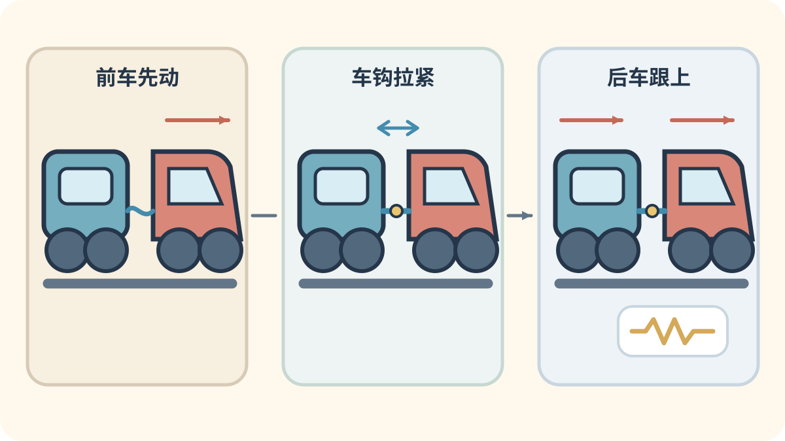
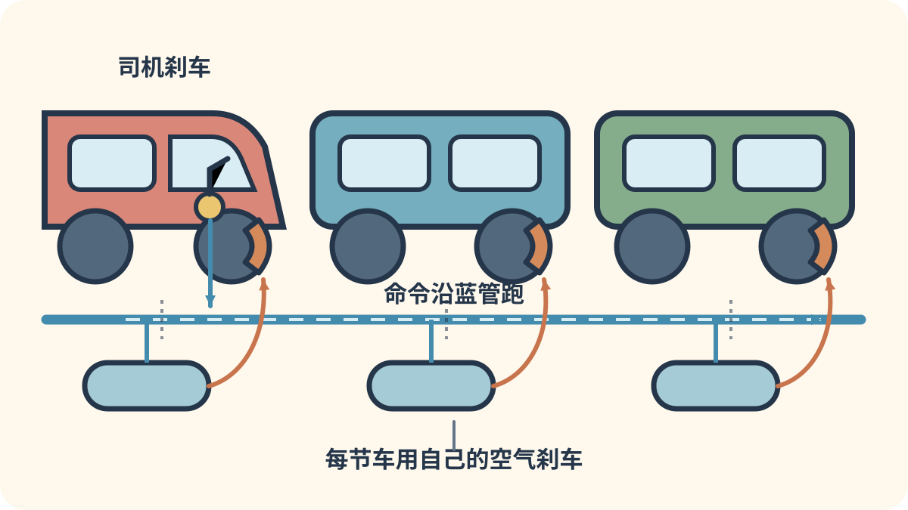
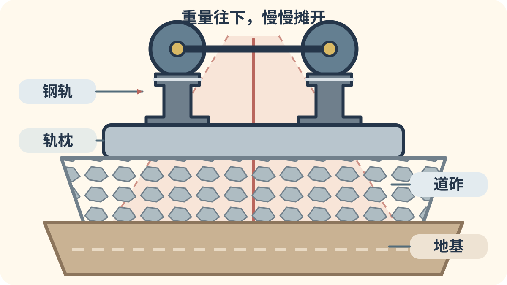

# 第十章：火车头和铁路工作队

[← 卧铺、观光与角色列车](09_sleeper_scenic.md) · [🏠 全书首页](README.md) · [特别的导轨列车 →](11_unusual_guideways.md)

有些列车把动力分在许多节车厢里；有些火车头自己不装乘客，专门拉着客车或货车前进。除雪车和工程车还会照顾铁路。想找跑在高速线上的检测车，可以去[第五章](05_high_speed_specialists.md)看看黄色医生。

看到 **🔍 打开看看**，可以停下来拆开一个小秘密，也可以先跳过继续看车。

🚉 选一个小站

今天挑一个小站就好，不用一次看完。

- [🚉 第1站：火车头老前辈](#train-018)（4 辆车）
- [🚉 第2站：世界火车头](#train-026)（4 辆车）
- [🚉 第3站：搬大箱子](#train-100)（2 辆车）
- [🚉 第4站：除雪和修路](#train-098)（2 辆车）

> 🚉 **第1站｜火车头老前辈**

## 018｜瑞士鳄鱼 Ce 6/8 II

**出生卡：** 1919｜瑞士｜电力机车

它的两头都有长长的“鼻子”，难怪大家叫它“鳄鱼”。中间车身和两端能稍微转动。车轮旁边的长连杆会一起动。受电弓从头顶电线取电。

**找找看：** 两端车轮旁边的连杆像不像一排尺子？

🔎 给大人看细节

Ce 6/8 II 为电气化的圣哥达山线而造，铰接式三段车体和连杆传动使它得到“鳄鱼”昵称；主图为保存至今的实车。

*图 018 · [作者与许可](IMAGE_CREDITS.md#img-t018-sbb-crocodile)*

---

## 021｜GG1 GG1

**出生卡：** 1934｜美国｜电力机车

GG1 两头都能当车头。圆润外壳上画着细细的长条纹。车顶受电弓从电线取电。它既拉过快客车，也拉过重货车。

**找找看：** 车顶有几只可以折叠的受电弓？

🔎 给大人看细节

宾夕法尼亚铁路于 1934—1943 年间购入 139 台 GG1；生产型的焊接流线车壳和条纹方案经工业设计师雷蒙德·洛伊改进。

*图 021 · [作者与许可](IMAGE_CREDITS.md#img-t021-gg1)*

---

## 023｜EMD F7 EMD F7

**出生卡：** 1949｜美国｜柴油电力机车

圆圆的高车头看起来很结实。柴油机带动发电机，电动机再转动车轮。几台 F7 可以一前一后连起来工作。它拉过货车，也穿过客运列车的亮丽外衣。

**找找看：** 车头正面有几扇窗、几盏灯？

🔎 给大人看细节

F7 是通用汽车电气动力分部最畅销的 F 系列“驾驶室单元”，1949 年投产，每个动力单元额定约 1,500 马力。

*图 023 · [作者与许可](IMAGE_CREDITS.md#img-t023-emd-f7)*

---

## 024｜VL80 VL80

**出生卡：** 1961｜苏联/俄罗斯｜电力货运

VL80 常常由两大节机车连在一起。每一节下面都有许多车轮。它从架空线取得交流电。它常用来牵引长长的重货列车。

**找找看：** 两节机车中间的连接门在哪里？

🔎 给大人看细节

VL80 是为 25 kV、50 Hz 交流电气化铁路制造的双节八轴货运机车家族，自 1961 年起发展出多个数量庞大的型号。

*图 024 · [作者与许可](IMAGE_CREDITS.md#img-t024-vl80)*

---

> 🚉 **第2站｜世界火车头**

## 026｜WAP-7 WAP-7

**出生卡：** 2000｜印度｜电力客运

WAP-7 常在印度干线上牵引客车。它举起受电弓，从头顶电线取电。两个转向架各有三根车轴。大功率电动机能拉很长的快速客车。

**找找看：** 白色车身上的红色带子绕到车头了吗？

🔎 给大人看细节

WAP-7 由印度奇塔兰詹机车厂自 2000 年起制造，是基于 WAG-9 平台发展的六轴交流客运电力机车。

*图 026 · [作者与许可](IMAGE_CREDITS.md#img-t026-wap-7)*

---

## 099｜EF66电力机车 JNR Class EF66

**出生卡：** 1968｜日本｜货运/卧铺牵引

EF66 自己没有乘客座位。它从头顶电线取电，用六根动力车轴拉动长列车。最早，它要把很重的货物快快送到远方。后来，它也拉过蓝色的夜行卧铺客车。

**找找看：** 车顶的两个受电弓，都抬起来了吗？

🔎 给大人看细节

EF66 为牵引 1,000 吨级高速货物列车而开发，持续功率 3,900 千瓦；国铁后期起，0 番台也担当多趟“蓝色列车”卧铺特急。

*图 099 · [作者与许可](IMAGE_CREDITS.md#img-t099-ef66)*

---

## 154｜东风4B：柴油先发电

**出生卡：** 1984年｜中国｜柴油电传动机车

它肚子里的柴油机先转动发电机。电再送到牵引电动机，让车轮滚起来。机车后面可以拉着客车或货车出发。

**找找看：** 车身侧面能找到多少扇长长的散热窗？

🔎 给大人看细节

东风4B型于1984年开始批量制造，是柴油电传动干线机车；柴油机驱动发电机，电流经整流后供给直流牵引电动机。它不需要从架空电线取得牵引电力。

*图 154 · [作者与许可](IMAGE_CREDITS.md#img-t154-df4b)*

---

## 155｜HXD3D：红色电力火车头

**出生卡：** 2014年｜中国｜客运电力机车

红色火车头举起受电弓，碰到头顶电线。电动机把大力气送给六根轮轴。它在前面牵着许多客车跑。

**找找看：** 车顶能找到像剪刀一样的受电弓吗？

🔎 给大人看细节

HXD3D于2014年投入运营，是六轴、7200千瓦的交流传动干线客运电力机车，最高运行速度为160公里每小时。它是牵引独立客车的机车，不是动力分散式动车组。

*图 155 · [作者与许可](IMAGE_CREDITS.md#img-t155-hxd3d)*

---

> 🚉 **第3站｜搬大箱子**

## 100｜EH500金太郎 JR Freight Class EH500 Kintaro

**出生卡：** 1997｜日本｜货运电力

金太郎由两节红色车身牵手组成。八根动力车轴一起出力，能拉动很长的货列。它还能适应几种不同的铁路供电。车身上的金太郎，正是传说中的大力士。

**找找看：** 两节车身的连接处，藏在哪一对转向架之间？

🔎 给大人看细节

EH500 由 JR 货物开发，是两节永久连接、共 8 根动力车轴的交直流电力机车，可适应直流及 50/60 赫兹交流供电区。

*图 100 · [作者与许可](IMAGE_CREDITS.md#img-t100-eh500)*

---

<!-- integrated-learning:after-100:start -->
### 🔍 机车一动，后面的车怎样跟上？

车钩把一辆车连到下一辆。前车先动，车钩慢慢拉紧。拉力再传到后车，长长的车队就一节一节跟上。

🔎 给大人再讲一点

牵引和制动会在列车中形成纵向拉力或压力。缓冲和弹性元件会吸收部分冲击，司机也要平稳操纵，避免过大的纵向力。

**一起找：** 只在照片或开放展区护栏外找车钩，绝不进入两车之间。
<!-- integrated-learning:after-100:end -->

---

## 101｜M250 Super Rail Cargo M250 series

**出生卡：** 2004｜日本｜货运动车组

普通货列常由一台机车在前面拉。M250 却把电动设备装进列车两端的车辆。中间的小平台驮着一只只集装箱。它在夜里快速奔跑，把急件送往东京和大阪方向。

**找找看：** 驾驶车后面，能数出多少只方方的集装箱？

🔎 给大人看细节

M250 系是 16 节电力货运动车组，2004 年投入东京货物总站至安治川口间的 Super Rail Cargo，最高营业速度为 130 千米/时。

*图 101 · [作者与许可](IMAGE_CREDITS.md#img-t101-m250)*

---

<!-- integrated-learning:after-101:start -->
### 🔍 车头要停车，最后一节怎么知道？

图里的蓝色长管，从车头一直连到最后一节。车头要刹车，每节车都会“听见”。每节车再用自己的小气罐，把刹车推上去。

🔎 给大人再讲一点

图中是经典自动空气制动：制动管压力降低时，各车控制阀把副风缸中的空气送入制动缸。现代动车组还可能用电信号指挥电空制动，并和再生制动混合。

**一起找：** 在博物馆隔着护栏找车厢间的空气软管；不触摸、不钻入连接处。
<!-- integrated-learning:after-101:end -->

---

> 🚉 **第4站｜除雪和修路**

## 098｜DE15除雪柴油机车 JNR Class DE15

**出生卡：** 1967｜日本｜除雪柴油机车

大雪盖住铁轨时，DE15 会来开路。前方的雪犁像一把又宽又硬的铲子。柴油机让车轮用力向前，雪被推向轨道两边。没有厚雪时，部分车辆还能卸下除雪装置做别的工作。

**找找看：** 大雪犁的左右两边，朝哪个方向张开？

🔎 给大人看细节

DE15 以 DE10 型柴油机车为基础，配有可拆卸的无动力除雪头；不同亚型可在一端或两端安装除雪装置。

*图 098 · [作者与许可](IMAGE_CREDITS.md#img-t098-de15-snowplow)*

---

## 102｜现代捣固车 Modern tamping machine

**出生卡：** 2000年代代表｜世界｜线路养护

铁轨下面铺着许多道砟小石子。列车跑久了，有些石子会松动。捣固车轻轻抬正铁轨，再用会振动的捣固镐压紧石子。它走过以后，轨道会更平顺、更稳当。

**找找看：** 车身下面，哪几根工具会伸进石子中间？

🔎 给大人看细节

现代捣固车通常把测量、起道、拨道和捣固连续完成；捣固镐在轨枕两侧振动并夹实道砟，使轨枕获得均匀支承。

*图 102 · [作者与许可](IMAGE_CREDITS.md#img-t102-tamping-machine)*

---

<!-- integrated-learning:after-102:start -->
### 🔍 跟着捣固车看地下：钢轨下面藏着什么？

*写实剖面插图（AI 生成，不是实拍）：帮助看清轨道的上下层。· [生成说明](GENERATED_PRINCIPLE_IMAGES.md#track-layers-cutaway)*

先看大图：两条钢轨下面，还有轨枕、碎石和更厚的地基。

车轮先压住钢轨。钢轨和轨枕把重量摊开。下面的碎石托住轨枕，还让雨水流走。更下面的地基把整条铁路稳稳撑住。

🔎 给大人再讲一点

有砟轨道由钢轨、扣件、轨枕、道砟和下部结构共同承载。板式轨道替代大部分道砟，却仍需要可靠基础、弹性部件和排水。生成图只展示一种常见概念层次，并非施工图。

**一起找：** 只从站台安全线内或照片比较：钢轨下面是碎石，还是一整块混凝土板？
<!-- integrated-learning:after-102:end -->

---

[← 卧铺、观光与角色列车](09_sleeper_scenic.md) · [🏠 全书首页](README.md) · [特别的导轨列车 →](11_unusual_guideways.md)
