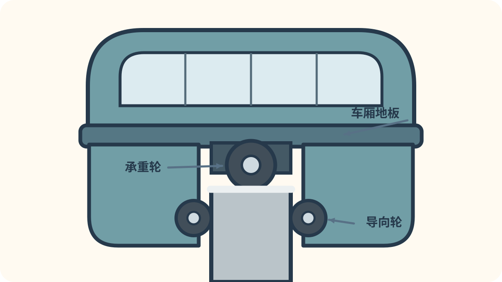
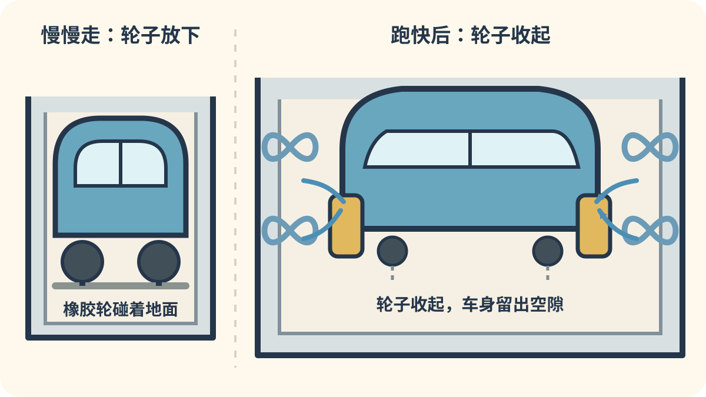
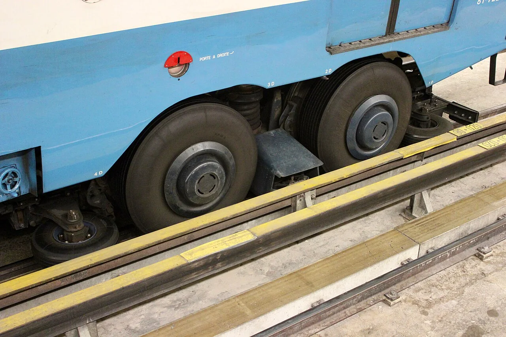

# 第十一章：骑梁、倒挂、胶轮和磁浮

[← 火车头和铁路工作队](10_work_trains.md) · [🏠 全书首页](README.md) · [爬山的火车 →](12_mountain_railways.md)

两根钢轨不是唯一的路线。有的车骑在梁上，有的挂在轨道下面，有的穿着橡胶鞋，还有的被磁力托起来。先找轨道在哪里，再猜它怎样前进。

看到 **🔍 打开看看**，可以停下来拆开一个小秘密，也可以先跳过继续看车。

🚉 选一个小站

今天挑一个小站就好，不用一次看完。

- [🚉 第1站：倒挂在轨道下面](#train-103)（3 辆车）
- [🚉 第2站：骑在轨道梁上](#train-104)（3 辆车）
- [🚉 第3站：被磁力托起来](#train-108)（4 辆车）
- [🚉 第4站：穿橡胶鞋走导轨](#train-111)（4 辆车）

> 🚉 **第1站｜倒挂在轨道下面**

## 103｜伍珀塔尔悬挂铁路 Wuppertal Schwebebahn GTW 15

**出生卡：** 线路 1901 年开放；这代车 2016 年载客｜德国｜悬挂式铁路

轨道和轮子都在车厢上面。车厢吊在下面，像一只结实的篮子。线路有一段沿着河面伸展。今天的新车仍在这条百年老路上行驶。

**找找看：** 车厢和上方轨道之间，有几根“脖子”？

🔎 给大人看细节

GTW 15 是现役车辆的一代；“悬挂”不等于“磁悬浮”，它仍由轮子在上方钢轨上滚动。

*图 103 · [作者与许可](IMAGE_CREDITS.md#img-t103-wuppertal-gtw15)*

---

## 106｜千叶都市单轨 Urban Flyer 0 型

**出生卡：** 2012｜日本千叶｜悬挂式单轨

车轮藏在头顶的箱形轨道里。车厢吊在下方，从街道上空经过。地板附近也有小窗，可以看见脚下。转弯时，车身会轻轻摆动。

**找找看：** 轨道是在车顶上，还是在车底下？

🔎 给大人看细节

千叶都市单轨采用 SAFEGE 式悬挂结构；0 型又称 Urban Flyer。

*图 106 · [作者与许可](IMAGE_CREDITS.md#img-t106-chiba-urban-flyer)*

---

<!-- integrated-learning:after-106:start -->
### 🔍 看千叶单轨：倒挂的车挂在哪里？

刚才那张照片里，车厢在梁的下方，上方的轮子却看不见。

千叶单轨把轮子藏在上面的轨道梁里。结实的连接架穿出梁底，把车厢吊住。它看起来飘在空中，其实仍是轮子在滚。

🔎 给大人再讲一点

图中讲的是千叶都市单轨采用的箱形梁内走行结构。悬挂铁路还有其他构造；它们通常都通过上方走行装置和悬吊构件把重量传给轨道。

**一起找：** 从安全位置找车厢和轨道之间那根结实的“脖子”。
<!-- integrated-learning:after-106:end -->

---

## 107｜湘南单轨 5000 系

**出生卡：** 2004｜日本神奈川｜悬挂式单轨

它也把轮子藏在上方轨道里。线路有坡、有弯，还有隧道。窗外一下看屋顶，一下看山坡。坐起来很像一趟空中探险。

**找找看：** 车厢上方哪一部分把它接到轨道？

🔎 给大人看细节

5000 系的走行轮与导向轮在箱形轨道内滚动；它不是磁悬浮，也不是缆车。

*图 107 · [作者与许可](IMAGE_CREDITS.md#img-t107-shonan-monorail-5000)*

---

> 🚉 **第2站｜骑在轨道梁上**

## 104｜东京单轨电车 10000 型

**出生卡：** 2014｜日本东京｜跨座式单轨

这列车骑在一根粗粗的梁上。轮胎藏在车身下面和两侧。它会经过城市、运河和机场。坐在窗边，常能看见飞机。

**找找看：** 粗轨道梁的顶面，是不是被车身挡住了？

🔎 给大人看细节

东京单轨连接市区与羽田机场；10000 型自 2014 年开始营业运行。

*图 104 · [作者与许可](IMAGE_CREDITS.md#img-t104-tokyo-monorail-10000)*

---

<!-- integrated-learning:after-104:start -->
### 🔍 看东京单轨：它怎样骑住一根梁？

刚才那张照片里，宽梁钻进了车身下面，像被列车骑住了。

大橡胶轮在梁顶滚，托住车身。侧面的小轮抱住梁，帮列车转弯。乘客坐在更上面的车厢里，轮子藏在地板下面。

🔎 给大人再讲一点

竖向走行轮承担重量，横向导向轮提供侧向导向。换线时通常要移动或弯转一段较大的轨道梁，道岔和普通钢轨很不一样。

**一起找：** 在站台护栏内看，车身是不是把轨道梁顶面遮住了。
<!-- integrated-learning:after-104:end -->

---

## 105｜迪士尼度假区线 Type C

**出生卡：** 2020｜日本千叶｜环形跨座式单轨

它绕着度假区一圈圈行驶。车轮跨坐在高架大梁上。圆圆的窗户和吊环很容易认。不同列车还会穿不同颜色的外衣。

**找找看：** 照片里有几个圆耳朵形状？

🔎 给大人看细节

Type C 是 2020 年起陆续投入的车辆；主题装饰不改变它作为跨座式单轨的基本结构。

*图 105 · [作者与许可](IMAGE_CREDITS.md#img-t105-disney-resort-type-c)*

---

## 157｜重庆2号线 QKZ2：骑在梁上的单轨

**出生卡：** 2005年｜中国重庆｜跨座式单轨

这列单轨像骑马一样骑在一根轨道梁上。大橡胶轮在梁顶滚，导向轮从两边帮它转弯。山城的弯道和坡道里都能看见它忙碌。

**找找看：** 轨道梁藏在列车正下方，还是挂在列车上方？

🔎 给大人看细节

重庆轨道交通2号线于2005年6月开通试运营，是中国第一条跨座式单轨线路。这里的QKZ2指早期四辆编组车型；2号线后来还投入六辆编组等车辆，不能把全线所有列车都叫作QKZ2。

*图 157 · [作者与许可](IMAGE_CREDITS.md#img-t157-chongqing-qkz2-monorail)*

---

> 🚉 **第3站｜被磁力托起来**

## 108｜Linimo 100 系

**出生卡：** 2005｜日本爱知｜常导磁悬浮

电磁铁把车身托离导轨一点点。列车不用钢轮一直压着轨道跑。直线电机沿着线路拉它前进。即使慢慢进站，它通常也保持悬浮；只有发生故障时，备用滚轮才会帮忙。

**找找看：** 它的车头很低，和新干线的长鼻子一样吗？

🔎 给大人看细节

Linimo 是常导、低速城市磁悬浮，悬浮间隙约 8 毫米；不要与超导 L0 系混为一谈。

*图 108 · [作者与许可](IMAGE_CREDITS.md#img-t108-linimo)*

---

## 109｜上海磁浮 Transrapid

**出生卡：** 2004｜中国上海｜高速常导磁悬浮

它用磁力托起、引导并推动列车。专用导轨看起来像一条宽梁。车头圆滑，适合快速穿过空气。它把机场和城市交通连在一起。

**找找看：** 它的导轨像普通两根钢轨吗？

🔎 给大人看细节

上海磁浮采用德国 Transrapid 技术；商业运行最高速度会随运营安排调整，因此儿童正文不写固定数字。

*图 109 · [作者与许可](IMAGE_CREDITS.md#img-t109-shanghai-maglev)*

---

## 110｜L0 系超导磁悬浮

**出生卡：** 2013 年开始试验｜日本｜超导磁悬浮试验车

它的鼻子又细又长。速度低时，小轮子先托着列车。加快以后，磁力让车身浮起来。它正在为未来的中央新干线试验技术。

**找找看：** 车头从尖端到车窗，有多长一段没有座位？

🔎 给大人看细节

L0 系以约 500 千米/小时的未来营业速度为设计目标；它使用超导磁体，与 Linimo 的常导系统不同。

*图 110 · [作者与许可](IMAGE_CREDITS.md#img-t110-l0-maglev)*

---

<!-- integrated-learning:after-110:start -->
### 🔍 L0 什么时候用轮子，什么时候浮起来？

刚才那张照片里，L0 的车身跑在 U 形导轨中间。

L0 慢慢走时，橡胶轮落下来。跑快以后，轮子收起来。车身两边的磁铁和侧边线圈把车托起，另一组线圈再推着它向前走。

🔎 给大人再讲一点

JR Central 的 SCMaglev 在约 150 km/h 以上收起低速橡胶轮，悬浮间隙约 10 cm；推进、悬浮和导向线圈均布置在导轨侧壁，导向力让列车保持在中间。Linimo、Transrapid 等磁浮系统的磁铁、间隙与低速支撑方式不同，不能套用这张 L0 图。

**一起找：** 看 L0 低速进站视频，找找车身下方有没有伸出的橡胶轮。
<!-- integrated-learning:after-110:end -->

---

## 158｜长沙磁浮快线：浮起一点点

**出生卡：** 2016年｜中国长沙｜中低速磁浮列车

它的车轮没有压在两条钢轨上。磁力让车身在导轨上方浮起一点点，直线电动机再推它前进。它在长沙南站和机场之间来回跑。

**找找看：** 车下能看到普通火车那样的两条钢轨吗？

🔎 给大人看细节

长沙磁浮快线于2016年5月开通试运营，采用国产常导中低速磁浮系统，列车为三辆编组，设计最高速度为100公里每小时。列车工作时的悬浮间隙约为8毫米，与上海高速磁浮的速度等级和用途不同。

*图 158 · [作者与许可](IMAGE_CREDITS.md#img-t158-changsha-maglev)*

---

> 🚉 **第4站｜穿橡胶鞋走导轨**

## 111｜百合鸥号 7500 系

**出生卡：** 2018｜日本东京｜自动导向胶轮列车

它在专用高架路上滚着橡胶轮胎。旁边的导向轮帮它沿线路转弯。车上平常没有驾驶员手动开车。坐在最前面，就能看见轨道向远处伸去。

**找找看：** 它只有一根梁吗，还是走在一条平整的路上？

🔎 给大人看细节

百合鸥号是自动导向交通系统，不是单轨；7500 系是 7300 系家族的后续批次。

*图 111 · [作者与许可](IMAGE_CREDITS.md#img-t111-yurikamome-7500)*

---

## 112｜神户 Port Liner 2000 型

**出生卡：** 2006｜日本神户｜自动导向胶轮列车

这列小车穿梭在城市、港口和人工岛之间。橡胶轮胎在平整走行面上滚动。侧边导向轮让它不会跑偏。列车由系统自动控制。

**找找看：** 一列车有几节短短的车厢？

🔎 给大人看细节

神户 Port Liner 是日本早期投入营业的无人自动导向交通系统之一；2000 型于 2006 年登场。

*图 112 · [作者与许可](IMAGE_CREDITS.md#img-t112-port-liner-2000)*

---

## 113｜札幌地铁 9000 型

**出生卡：** 2015｜日本札幌｜中央导向胶轮地铁

它穿着橡胶轮胎在走行面上滚。线路中央还有导向轨，帮列车认路。车厢为寒冷多雪的城市服务。大部分旅程都藏在地下。

**找找看：** 车头中央的蓝紫色线条像不像一条领带？

🔎 给大人看细节

札幌地铁各线采用胶轮与中央导向方式；9000 型服务于东丰线。

*图 113 · [作者与许可](IMAGE_CREDITS.md#img-t113-sapporo-9000)*

---

## 138｜巴黎MP14：穿橡胶鞋的地铁

**出生卡：** 2020年｜法国巴黎｜胶轮地铁

MP14 脚下藏着橡胶轮胎。车厢连通，走起来像一条长长走廊。14号线的这一版会自动驾驶。

**找找看：** 车头的黑色大窗像不像一张面具？

🔎 给大人看细节

MP14于2020年首先在巴黎地铁14号线投入服务，这个家族有不同车长和驾驶方式的版本，并非每一列都完全相同。

*图 138 · [作者与许可](IMAGE_CREDITS.md#img-t138-paris-mp14)*

---

<!-- integrated-learning:after-138:start -->
### 🔍 把胶轮转向架搬出来：一共有几种轮子？

*实拍：胶轮地铁的转向架。不同城市会有不同构造。· [图片署名](PRINCIPLE_PHOTO_CREDITS.md#principle-photo-p008-rubber-tyred-bogie)*

先看真车：大橡胶轮托住车身，旁边还有小一些的导向轮。

大橡胶轮在平整路面上滚。侧面的小轮贴着导向面，告诉车辆往哪里走。有的系统还留下钢轮和钢轨当帮手。

🔎 给大人再讲一点

橡胶轮胎常有较大黏着力，利于频繁加速和制动，但滚动阻力与发热也更大。不同系统的导向、回流和故障支撑办法不相同。

**一起找：** 在站台安全线内听一听，胶轮和钢轮的滚动声有什么不同。
<!-- integrated-learning:after-138:end -->

---

[← 火车头和铁路工作队](10_work_trains.md) · [🏠 全书首页](README.md) · [爬山的火车 →](12_mountain_railways.md)
