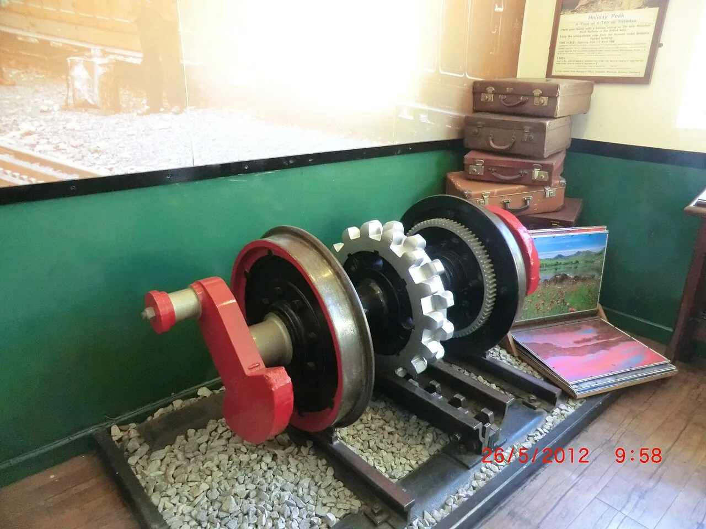
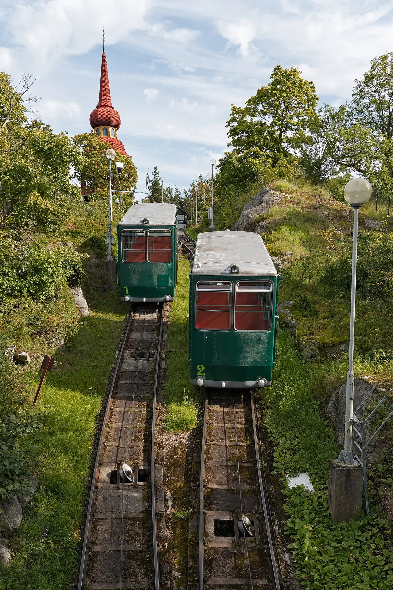

# 第十二章：爬山的火车

[← 特别的导轨列车](11_unusual_guideways.md) · [🏠 全书首页](README.md)

山地列车不都使用齿轨或缆索。有的仍靠普通钢轮，沿着弯道和缓一些的坡慢慢升高；有的让齿轮咬住齿轨，还有的由缆索拉动。把这些办法放在一起，看看火车怎样从山脚走向山顶。

看到 **🔍 打开看看**，可以停下来拆开一个小秘密，也可以先跳过继续看车。

🚉 选一个小站

今天挑一个小站就好，不用一次看完。

- [🚉 第1站：钢轮沿山路慢慢爬](#train-115)（4 辆车）
- [🚉 第2站：齿轮咬住中间齿轨](#train-027)（2 辆车）
- [🚉 第3站：缆索拉上山](#train-117)（3 辆车）
- [🚉 第4站：又吊着、又被缆索拉](#train-119)（1 辆车）

> 🚉 **第1站｜钢轮沿山路慢慢爬**

## 115｜箱根登山电车 3000 型 Allegra

**出生卡：** 2014｜日本神奈川｜陡坡山地电车

它用普通钢轮爬很陡的山。线路用急弯和折返慢慢升高。到了折返处，列车会换个方向继续走。大窗户把山林装进车厢。

**找找看：** 轨道旁边，能找到写着“80”的小牌子吗？

🔎 给大人看细节

箱根登山铁路最大坡度达 80‰，但不是齿轨铁路；折返式线路与强力制动帮助它翻山。

*图 115 · [作者与许可](IMAGE_CREDITS.md#img-t115-hakone-allegra)*

---

## 145｜南海30000系 Koya／Rinkan：大窗山路号

**出生卡：** 1983年｜日本大阪、高野山方向｜山岳特急电车

红白车头有一扇大大的中间窗。担当 Koya 时，它会沿弯弯山路去极乐桥。担当 Rinkan 时，它跑到桥本就完成任务。

**找找看：** 车头正中间的大窗像什么形状？

🔎 给大人看细节

南海30000系于1983年登场，可担当难波至极乐桥的Koya或难波至桥本的Rinkan，实际班次使用的车型会随运用安排变化。

*图 145 · [作者与许可](IMAGE_CREDITS.md#img-t145-nankai-30000-koya)*

---

## 146｜南海31000系 Koya／Rinkan：能和伙伴连接

**出生卡：** 1999年｜日本大阪、高野山方向｜山岳特急电车

它是 30000 系的年轻伙伴。车头中间有门，可以和别的特急连接。四节一组，有时两组牵手变成八节。

**找找看：** 和上一张的大玻璃窗相比，这张车头多了哪一扇门？

🔎 给大人看细节

南海31000系于1999年登场，可与30000系或11000系连挂，并会用于Koya和Rinkan等服务。

*图 146 · [作者与许可](IMAGE_CREDITS.md#img-t146-nankai-31000-koya)*

---

## 147｜GRAN 天空（2000系改造车）：深红色的新山岳列车

**出生卡：** 2026年｜日本大阪、高野山方向｜2000系改造观光特急

深红车身上长着金色翅膀。四节车厢里，有看风景的座位和一间小小休息厅。它从难波出发，沿弯弯山路去极乐桥。

**找找看：** 金色翅膀旁藏着哪些叶子和花朵？

🔎 给大人看细节

GRAN天空于2026年4月24日开始运行，使用2000系改造的四辆编组连接难波与极乐桥；它不是旧绿色2200系“天空”，后者已于2026年3月20日结束定期运行。

*图 147 · [作者与许可](IMAGE_CREDITS.md#img-t147-nankai-gran-tenku)*

---

> 🚉 **第2站｜齿轮咬住中间齿轨**

## 027｜冰川快车 Glacier Express

**出生卡：** 1930起/全景车2006｜瑞士｜观光列车

这趟列车穿过瑞士阿尔卑斯山。大窗户一直弯到车顶，方便抬头看山。部分山路中间有齿轨，帮列车稳稳爬坡。途中还会经过桥梁、隧道和很深的山谷。

**找找看：** 全景窗的玻璃从车身一直伸到哪里？

🔎 给大人看细节

冰川快车的贯通服务始于 1930 年，由马特洪—圣哥达铁路与雷蒂亚铁路共同运营；路线中的部分区间使用齿轨，因此它也适合放在本章比较。如今熟悉的全景客车是后来的更新，并非 1930 年原车。

*图 027 · [作者与许可](IMAGE_CREDITS.md#img-t027-glacier-express)*

---

## 116｜大井川铁道 ED90 齿轨机车

**出生卡：** 1990｜日本静冈｜齿轨电力机车

两根普通钢轨中间多了一条“拉链”。机车底下的齿轮咬住它。这样爬陡坡时，不容易打滑。小机车会帮助列车通过最陡的一段。

**找找看：** 车身侧面的“齿条”小图案，像不像一排牙齿？

🔎 给大人看细节

大井川铁道井川线的陡坡区间采用 Abt 式齿轨；ED90 在 1990 年线路改建后投入使用。

*图 116 · [作者与许可](IMAGE_CREDITS.md#img-t116-oigawa-ed90)*

---

<!-- integrated-learning:after-116:start -->
### 🔍 真正的齿轨：中间那条“拉链”怎样咬住？

*实拍：车底齿轮咬住轨道中央的齿条。· [图片署名](PRINCIPLE_PHOTO_CREDITS.md#principle-photo-p006-rack-pinion)*

先看真齿轨：圆齿轮的牙，正好塞进中间齿条的缝里。

山坡太陡时，钢轮可能抓不稳。轨道中间就多了一条带牙齿的“拉链”。车底齿轮一格一格咬住它，帮列车爬山和下坡。

🔎 给大人再讲一点

普通铁路靠轮轨黏着传力；齿轮和齿条用几何啮合传力，也常参与下坡制动。不同齿轨系统的齿形并不相同。

**一起找：** 在照片里找两根普通钢轨中间有没有一条“拉链”。
<!-- integrated-learning:after-116:end -->

---

> 🚉 **第3站｜缆索拉上山**

## 117｜高野山缆车 N10/N20 型

**出生卡：** 2019｜日本和歌山｜缆索铁路

车厢沿着陡陡的山坡排成台阶。钢索拉着它上山和下山。常见运行里，两辆车一上一下互相帮忙。乘客坐着，地板不会像山坡一样斜。

**找找看：** 车厢是不是朝山上仰着头？

🔎 给大人看细节

现行 N10/N20 型为高野山缆车第四代车辆，于 2019 年投入营业。

*图 117 · [作者与许可](IMAGE_CREDITS.md#img-t117-koyasan-cable)*

---

<!-- integrated-learning:after-117:start -->
### 🔍 两辆缆车：为什么总在半路遇见？

*实拍：两辆缆车正在中间的会车区交会。· [图片署名](PRINCIPLE_PHOTO_CREDITS.md#principle-photo-p007-funicular-passing-loop)*

先看真缆车：一辆在左边，一辆在右边，它们刚好在半山遇见。

两辆车常连在同一套缆索上。一辆上山，另一辆下山。它们在中间的会车区遇见，再继续去两头的车站。

🔎 给大人再讲一点

两车质量接近时能减少电动机需要克服的差额，但机器仍要克服摩擦、加速车辆并补偿乘客重量差。系统还配有工作制动和安全制动。

**一起找：** 从车站安全区或视频找找，两辆车是不是在坡道中间交会。
<!-- integrated-learning:after-117:end -->

---

## 118｜黑部登山缆车

**出生卡：** 1969｜日本富山｜全地下缆索铁路

整条线路都藏在山肚子里。缆索拉着车厢走过黑暗坡道。这样可以少让大雪盖住轨道。上下车站连接着壮观的立山黑部路线。

**找找看：** 照片里能看见天空吗？

🔎 给大人看细节

黑部登山缆车全线位于隧道内，是立山黑部阿尔卑斯路线的一段。

*图 118 · [作者与许可](IMAGE_CREDITS.md#img-t118-kurobe-cable)*

---

## 120｜Stoos 桶形缆车

**出生卡：** 2017｜瑞士｜超陡缆索铁路

一节节车厢像透明圆桶。山坡越来越陡时，圆桶会慢慢转动。车内地板因此仍接近平平的。钢索带着整列车爬上山村。

**找找看：** 每个圆桶的地板，和山坡是不是同一个角度？

🔎 给大人看细节

新 Stoosbahn 最大坡度为 110%（约 47.7 度）；旋转乘客舱让地板随坡度保持水平。

*图 120 · [作者与许可](IMAGE_CREDITS.md#img-t120-stoosbahn)*

---

> 🚉 **第4站｜又吊着、又被缆索拉**

## 119｜广岛 Skyrail 200 型

**出生卡：** 1998-2024｜日本广岛｜已停运的悬挂式缆索交通

小车厢像胶囊一样吊在轨道下。站间由缆索拉着它爬陡坡。到车站时，直线电机帮它加速和减速。这个特别系统已经结束营业，但照片留下了它的样子。

**找找看：** 一辆小车里大约能坐多少人？先用车窗猜一猜。

🔎 给大人看细节

Skyrail Midorizaka Line 于 2024 年 5 月结束营业；它结合悬挂走行、缆索牵引与站内直线电机。

*图 119 · [作者与许可](IMAGE_CREDITS.md#img-t119-hiroshima-skyrail)*

---

[← 特别的导轨列车](11_unusual_guideways.md) · [🏠 全书首页](README.md)
