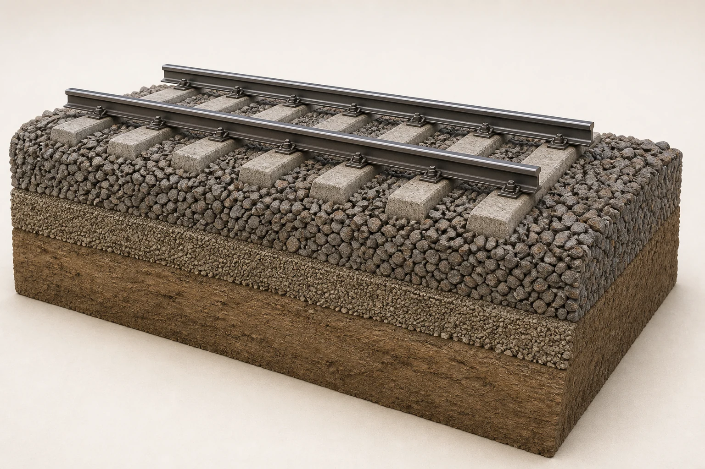

# AI 生成原理剖面图记录

本页记录两张由 Codex 内置 ImageGen 以“文字生成图片”方式制作的教育剖面插图。它们用来帮助孩子看见难以拍摄的内部关系，**不是实拍照片，也不是工程图**。图中的比例、零件数量、连接位置和材料细节都可能经过简化，不能用于制造、施工、维修、安全判断或车型鉴定。

<a id="track-layers-cutaway"></a>

## 铁路轨道分层剖面



- 本地文件：`images/principles/generated/track-layers-cutaway.webp`
- 生成源文件：`/Users/g4i/.codex/generated_images/019f75f7-c304-79e1-9998-31f0edf8f5e0/exec-3e69a5d3-b6da-4893-9096-e8e3a2b08199.png`
- 尺寸：1536 × 1024 像素
- SHA-256：`5d10247af8dc807b6051bbcec6849a5e8e4aaf81bd1e55577dc4d7acaaf1cb97`
- 人工核查边界：确认画面按“钢轨—扣件—轨枕—道砟—下部颗粒层—土基”的上下关系表达，并检查两根钢轨平行、轨枕由道砟支承；未把它当作任何国家、线路或施工规范的标准断面。

完整提示词：

```text
Use case: scientific-educational
Asset type: landscape illustration for a train encyclopedia for four-year-old children
Primary request: a physically plausible semi-realistic 3D cutaway of one short section of conventional ballasted railway track, making the layers visible at a glance
Scene/backdrop: warm off-white studio background with no scenery
Subject: two shiny steel rails fixed to concrete sleepers with visible fasteners; sleepers resting inside a deep bed of angular gray-brown ballast stones; beneath the ballast a thinner compacted granular sub-ballast layer; beneath that a broad compacted earth formation. Show the front face as a clean geological cutaway while the top remains a believable real railway track.
Style/medium: polished realistic educational render, tactile materials, gentle children's museum aesthetic, not cartoon, not a flat infographic
Composition/framing: landscape 3:2, oblique three-quarter view, the full vertical stack visible, ample margins, one continuous track section only
Lighting/mood: soft diffuse daylight, calm and inviting
Color palette: restrained natural steel gray, concrete gray, muted brown and beige; medium-low saturation
Materials/textures: clearly different steel, concrete, angular ballast, fine compacted gravel, and soil textures
Constraints: scientifically plausible railway construction; rails parallel and correctly seated on sleepers; ballast surrounds and supports sleepers; no wheels or train; no labels, no arrows, no numbers, no text, no logos, no watermark
Avoid: impossible floating parts, extra rails, crossing tracks, bright saturated colors, toy-like plastic, dramatic cinematic lighting
```

<a id="diesel-electric-cutaway"></a>

## 柴油电力机车动力剖面


- 本地文件：`images/principles/generated/diesel-electric-cutaway.webp`
- 生成源文件：`/Users/g4i/.codex/generated_images/019f75f7-c304-79e1-9998-31f0edf8f5e0/exec-03b5838f-5ddf-4950-8ae7-dcdbc90c8a7f.png`
- 尺寸：1536 × 1024 像素
- SHA-256：`c1f2cda904676f4c32f4b51601c9e71f3369c27b06402d02841bb9eef180414d`
- 人工核查边界：确认主路径表达为“柴油机带动发电机—电缆送电—轴旁牵引电动机转动车轮”，并确认没有画成柴油机用传动轴直接连接车轮；这是一辆通用教育模型，不对应 DF4B 或其他具体车型的设备布置。

完整提示词：

```text
Use case: scientific-educational
Asset type: landscape cutaway illustration for a train encyclopedia for four-year-old children
Primary request: a physically plausible semi-realistic side cutaway of a generic diesel-electric locomotive that makes its power path visible without text
Scene/backdrop: warm off-white studio background, no landscape
Subject: one compact generic diesel-electric locomotive in clean side view. The upper body has a large open cutaway window showing a long diesel engine mechanically coupled directly to one cylindrical electric generator. Thick insulated electrical cables run from the generator downward to compact traction motors mounted beside the axles inside both bogies. The traction motors turn the wheelsets. Show two bogies, each with two steel wheelsets. No mechanical drive shaft from the diesel engine to the wheels.
Style/medium: accurate museum-quality realistic educational render with simplified but believable machinery; approachable for young children; not a flat icon and not photorealistic enough to pretend it is a real photograph
Composition/framing: landscape 3:2, exact side elevation with a slight three-quarter depth so machinery is readable, entire locomotive and all wheels visible, generous margins
Lighting/mood: soft diffuse daylight, calm and curious
Color palette: muted teal locomotive body, dark steel wheels, restrained copper and yellow cable accents, medium-low saturation
Materials/textures: painted metal shell, cast steel bogies, engine block, generator housing, insulated cables
Constraints: the sequence must be visibly diesel engine -> generator -> electrical cables -> traction motors at axles -> wheels; one generator only; no battery; no overhead wire; no pantograph; no labels, no arrows, no letters, no numbers, no text, no logos, no watermark
Avoid: a direct drive shaft to the wheels, automotive transmission, steam pipes, exposed dangerous sparks, floating machinery, extra axles, crossing tracks, bright toy colors
```

## 使用边界

- 正文图注必须写明“AI 生成的教育剖面插图，不是实拍”。
- 需要确认真实零件外形时，应查看带来源的实拍照片；需要确认具体车型或线路结构时，应查运营方、制造商或工程规范。
- 修改或重新生成图片时，要在本页更新最终提示词、尺寸、SHA-256 与人工核查边界，不能只替换文件。
